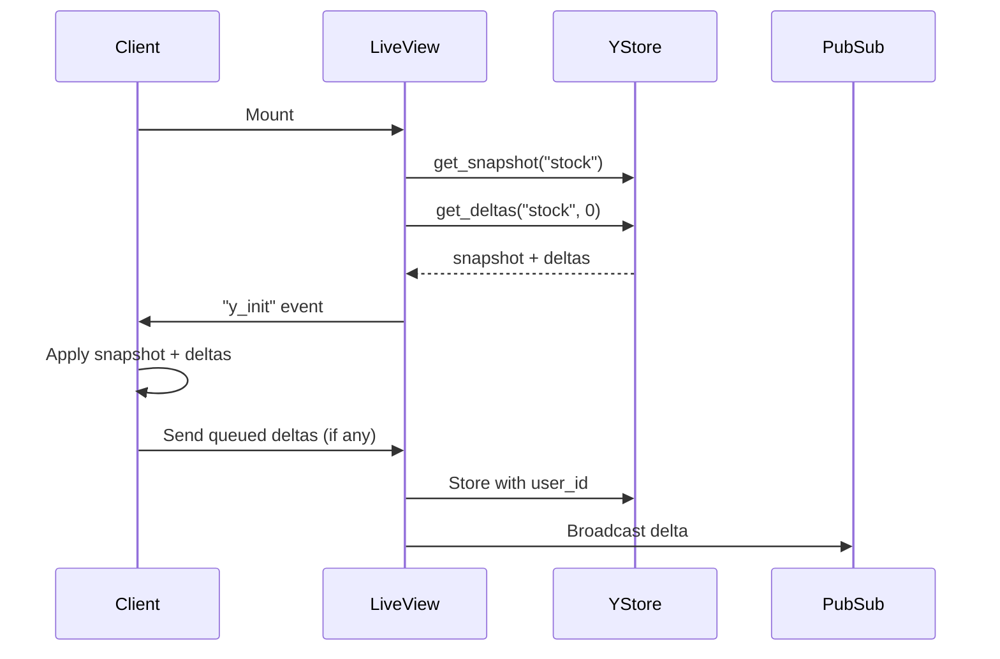
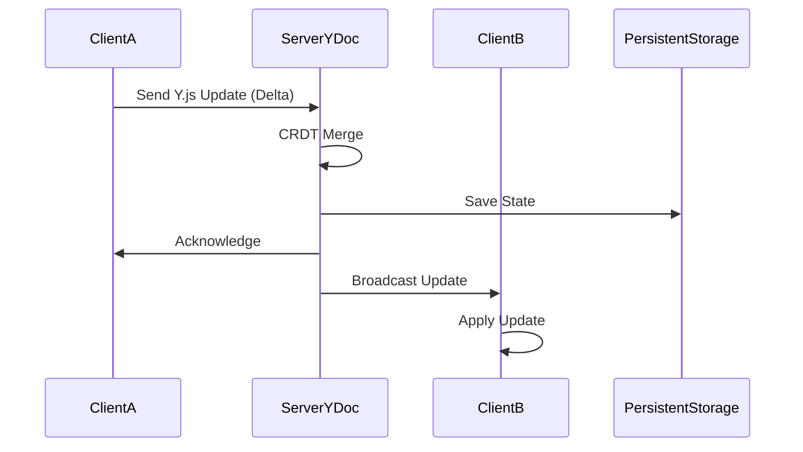
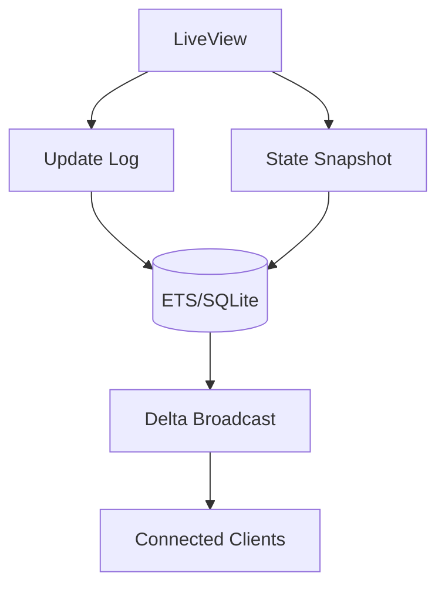
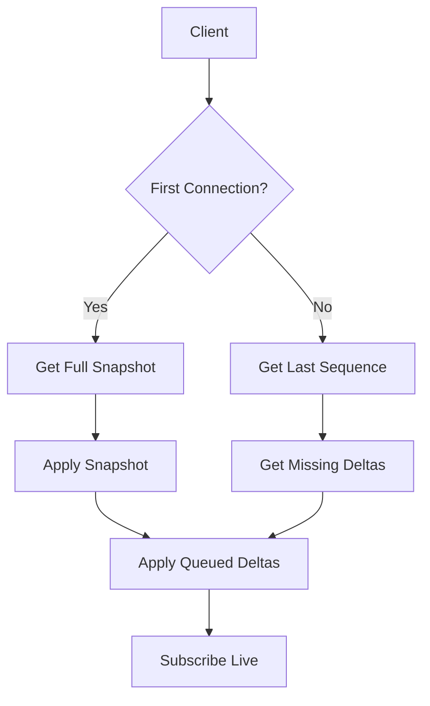
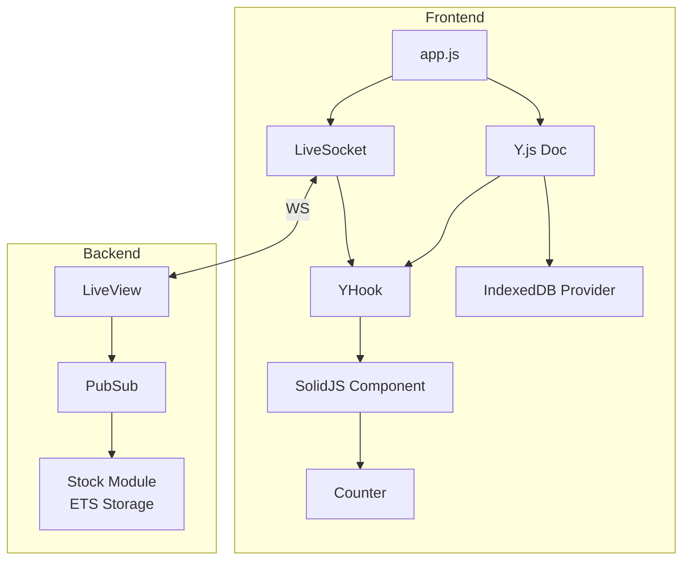

# Solidyjs

An Elixir-LiveView webapp with a real-time collaborative system with offline support (PWA).

Ingredients are:

- `Phoenix LiveView`
- [`Y.js` & `y-indexeddb`] or [`Valtio` & `localStorage`]
- `Vite`-plugin-PWA & `Workbox`
- `SolidJS`
- `Leafletjs`& MapTiler (for vector tiles)

## CSP evaluator

<https://csp-evaluator.withgoogle.com/>

## Guide

<https://vite-pwa-org.netlify.app/guide/>

### Offline Support

A service worker acts like a proxy that persists your HTML/JS/CSS in the web browser.
When all data is persisted using service workers,
you can even load your website without internet access.

Y.js's `IndexedDB` persistence handles offline support automatically.

When offline:

- Users can still modify the stock locally
- Changes are stored in IndexedDB
- When back online, YJS will sync changes

#### Flows









### GET `HEAD`connection check request

Avoids downloading the body, The server returns the HTTP headers, so no headers, no connection.

- `navigator.onLine` has limitations. After navigating offline, the browser incorrectly reports `navigator.onLine = true`. This prevents the online event from firing on reconnection.

For a reliable State Detection: The online and offline events alone cannot always determine connectivity, especially when the server is unreachable.

For a reliable State Detection:, one can implement a custom Polling: a server reachability check (via HEAD requests) ensures accurate detection of reconnection, independent of browser state.

This is done by running `setInterval`

Efficient Reloads: Using a reloaded flag in the polling logic allows the app to reload once on reconnection, avoiding redundant reloads or unnecessary complexity.

This approach ensures consistent synchronization of client and server states while maintaining accurate offline/online indicators.

### Airports list

Link: <https://openflights.org/data.php>

URL: <https://raw.githubusercontent.com/jpatokal/openflights/master/data/airports.dat>

#### Fields

- Airport ID: Unique OpenFlights identifier for this airport.
- Name: Name of airport. May or may not contain the City name.
- City: Main city served by airport. May be spelled differently from Name.
- Country: Country or territory where airport is located. See Countries to cross-reference to ISO 3166-1 codes.
- IATA: 3-letter IATA code. Null if not assigned/unknown.
- ICAO: 4-letter ICAO code.
- Latitude: Decimal degrees, usually to six significant digits. Negative is South, positive is North.
- Longitude: Decimal degrees, usually to six significant digits. Negative is West, positive is East.
- Altitude: In feet.
- DST: Daylight savings time. One of E (Europe), A (US/Canada), S (South America), O (Australia), Z (New Zealand), N (None) or U (Unknown). See also: Help: Time
- Tz: database timezone Timezone in "tz" (Olson) format, eg. "America/Los_Angeles".
- Type: Type of the airport. Value "airport" for air terminals, "station" for train stations, "port" for ferry terminals and "unknown" if not known. In airports.csv, only type=airport is included.
- Source

## Next

# Phoenix LiveView Collaborative App with offline first SolidJS components

A real-time collaborative web application demonstrating offline-first capabilities using Phoenix LiveView, SolidJS, and state managers, `Y.js` with CRDT, and `Valtio`.

The state manager bridges between the LiveView "hook" and the standalone SolidJS component.

The app features a shared counter (stock value) that can be modified by multiple users simultaneously while maintaining state consistency both online and offline.

## Architecture Overview - Stock counter with `Y.js`



### Online Mode

- `Phoenix LiveView` handles real-time communication via WebSocket
- `SolidJS` components render through LiveView hooks
- Y.js manages state synchronization with server-side persistence in ETS
- `Workbox` caches specific routes (`/` and `/map`) for offline availability
- Real-time updates broadcast via `Phoenix PubSub` to all connected clients

### Offline Mode

- Service Worker serves cached pages
- `SolidJS` component operates independently
- `Y.js` with `IndexedDB` maintains local state
- Automatic state reconciliation on reconnection

## Key Components

### Server-Side (Phoenix LiveView)

The `StockLive` module manages the real-time aspects:

```elixir
defmodule SolidyjsWeb.StockLive do
  use SolidyjsWeb, :live_view
  alias Phoenix.PubSub
  alias Solidyjs.Stock
```

Key features:

- PubSub subscription for real-time updates
- Initial state loading with Y.js binary state
- State synchronization via events
- User session management

State flow:

1. On mount:

   ```elixir
   def mount(_params, session, socket) do
     if connected?(socket) do
       PubSub.subscribe(:pubsub, "stock")
       {value, state} = Solidyjs.Stock.get_stock()
       # Initialize client with current state
     end
   end
   ```

2. State updates:

   ```elixir
   def handle_event("sync_state", %{"value" => value, "state" => encoded_state}, socket) do
     Stock.update_stock(value, encoded_state)
     {:noreply, socket}
   end
   ```

### Frontend Components

#### Counter Component

The main UI component for stock management:

```jsx
export default function Counter(props) {
  const handleTake = () => {
    // Circular range for demo purposes
    const newValue = props.stock === 0 ? props.max : props.stock - 1;
    props.onStockChange(newValue);
  };

  return (
    <>
      <button
        onClick={handleTake}
        class="font-bold py-2 mt-4 px-4 rounded border border-gray-800 bg-bisque"
      >
        Take from stock
      </button>
      <input
        type="range"
        min="0"
        max={props.max}
        value={props.stock}
        disabled
      />
    </>
  );
}
```

Features:

- Circular stock value management
- Read-only range input display
- Lazy-loaded bins visualization
- Tailwind CSS styling

#### Y.js Integration (`yHook.js`)

- Bridges LiveView and SolidJS component
- Manages initial state loading from server
- Handles remote updates via Phoenix PubSub
- Synchronizes local changes to server
- Manages reconnection logic

#### App Initialization (`app.js`)

```javascript
async function initApp(lineStatus) {
  const { default: initYdoc } = await import("./initYJS.js");
  const ydoc = await initYdoc();

  // Online mode
  if (lineStatus) {
    return initLiveSocket({ MapVHook, FormVHook, PwaHook, YHook });
  }

  // Offline mode
  const path = window.location.pathname;
  if (path === "/") {
    displayStock(ydoc);
  }
}
```

## State Synchronization Flow

1. **Initial page load**

   - Server sends initial state and Y.js binary state via LiveView
   - Y.js state is initialized from server data
   - Local IndexedDB state is applied if available

   ```mermaid
   sequenceDiagram
       participant Client
       participant ServiceWorker
       participant LiveView
       participant PubSub
       participant Stock

       Client->>ServiceWorker: Check cache status
       Client->>Client: Check status On or Off line
       alt is online
           Client->>LiveView: Connect
           LiveView->>PubSub: Subscribe to "stock"
           LiveView->>Stock: get_stock()
           Stock-->>LiveView: {value, state}
           LiveView-->>Client: init_stock event
           Client->>Client: Initialize Y.js
           Client->>Client: Apply server state
           Client->>Client: Render SolidJS component
       else is offline
           Client->>ServiceWorker: Get cached page
           ServiceWorker-->>Client: Cached content
           Client->>Client: Initialize Y.js with IndexedDB
           Client->>Client: Render standalone SolidJS
       end
   ```

   - This diagram shows the initialization process, including:

     - Online/offline detection
     - Service Worker cache management
     - LiveView connection and state initialization
     - Y.js setup and state application

2. **Online Updates**

   - Local changes update Y.js document
   - Changes are sent to server via LiveView's `sync_state` event
   - Server updates ETS storage and broadcasts via PubSub
   - Other clients receive updates through `sync_stock` event

   ```mermaid
   sequenceDiagram
    participant User
    participant SolidJS
    participant Y.js
    participant Hook
    participant LiveView
    participant PubSub
    participant OtherClients

    User->>SolidJS: Click "Take from stock"
    SolidJS->>Y.js: Update stock value
    Y.js->>Hook: Trigger update event
    Hook->>LiveView: sync_state event
    LiveView->>PubSub: Broadcast update
    PubSub->>OtherClients: Broadcast y_update
    OtherClients->>Y.js: Apply update
    Y.js->>SolidJS: Update UI
   ```

   - This diagram illustrates the real-time update process:
     - User interaction with SolidJS component
     - Y.js state management
     - LiveView hook communication
     - PubSub broadcasting
     - Client-side state updates

3. **Offline Updates**

   - Changes persist to IndexedDB through Y.js provider
   - Component updates reflect local changes
   - Stock value cycles through configured range

4. **Reconnection**

   - Connection status monitored via HTTP HEAD requests
   - Local state is sent to server upon reconnection
   - Server reconciles states
   - Updated state is broadcast to all clients

   ```mermaid
   sequenceDiagram
       participant Client
       participant ServiceWorker
       participant Y.js
       participant LiveView
       participant Stock

       Client->>Client: Detect online status
       Client->>ServiceWorker: Clear offline flag
       Client->>LiveView: Reconnect
       LiveView->>Stock: get_stock()
       Stock-->>LiveView: Current state
       LiveView-->>Client: sync_stock event
       Client->>Y.js: Apply server state
       Y.js->>Y.js: Merge with local changes
       Y.js->>LiveView: Send merged state
       LiveView->>Stock: Update with merged state
   ```

   - This diagram shows the reconciliation process when coming back online:
     - Online status detection
     - LiveView reconnection
     - State synchronization
     - Conflict resolution

## Setup and Configuration

### Prerequisites

- Elixir/Phoenix
- Node.js and Vite
- Browser with Service Worker support

### Installation

```bash
# Install dependencies
mix deps.get
cd assets && pnpm install

# Start Phoenix server
mix phx.server
```

### Environment Configuration

- Configure Phoenix endpoint for LiveView
- Set up Vite and PWA plugin
- Configure Workbox caching strategies

## Development

The application uses Vite for frontend builds with several plugins:

- vite-plugin-pwa for PWA support
- vite-plugin-solid for SolidJS compilation
- vite-plugin-wasm for WebAssembly support

## Network Resilience

The app implements several strategies for network resilience:

- Regular connectivity checks (every 10 seconds when offline)
- Automatic reconnection handling
- State reconciliation on network recovery
- Graceful degradation to offline mode
- PWA capabilities for offline access

## Future Improvements

Potential areas for enhancement:

- Implement more sophisticated conflict resolution
- Add real-time presence indicators
- Enhance state persistence mechanisms
- Add more collaborative features
- Improve offline-first capabilities
