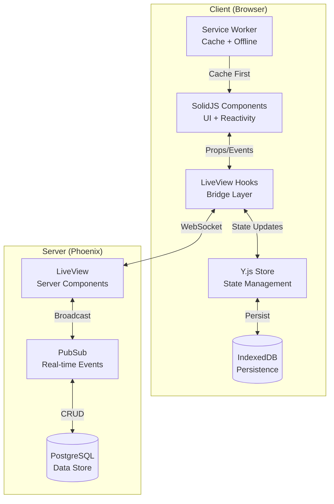
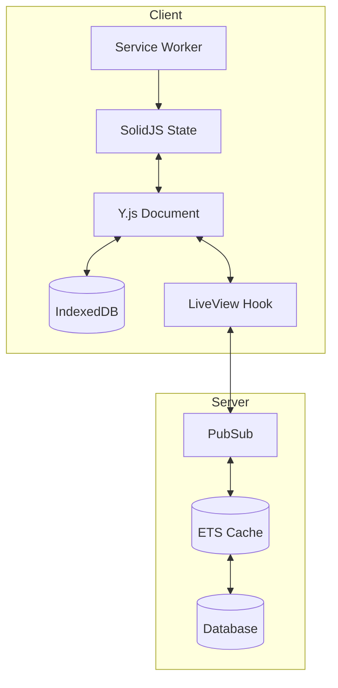

# Phoenix LiveView PWA with SolidJS

## Table of Contents

- [What](#what)
  - [Page-Specific State](#page-specific-state)
  - [Scope](#scope)
  - [Performance](#performance)
  - [Why](#why)
- [How](#how)
  - [Technical Cutover Overview](#technical-cutover-overview)
  - [Quick Implementation Guide](#quick-implementation-guide)
  - [Build Tool Evolution](#build-tool-evolution)
  - [Offline Support](#offline-support)
  - [Content Security Policy](#content-security-policy)
    - [Cross-Origin Isolation](#cross-origin-isolation)
  - [Component Integration](#component-integration)
  - [State Management](#state-management)
  - [State Synchronization Flow](#state-synchronization-flow)
- [Development](#development)
  - [Prerequisites](#prerequisites)
  - [Docker Support](#docker-support)
  - [Installation](#installation)
  - [Environment Configuration](#environment-configuration)
  - [Development Environment](#development-environment)
  - [Network Resilience](#network-resilience)
  - [Future Improvements](#future-improvements)

## What

A modern Progressive Web App (PWA) that combines Phoenix LiveView's real-time capabilities with SolidJS's reactive UI, featuring:

- Real-time collaboration through WebSocket
- Full offline support and navigation
- Seamless state synchronization
- Cached page navigation

## Page-Specific State

This application demonstrates two different approaches to state management:

**Stock Counter Page (path `/`)**: Uses Yjs (CRDT)

- Handles concurrent edits from multiple offline clients
- Automatically resolves conflicts using CRDT (Conflict-free Replicated Data Type)
- Persists state in IndexedDB for offline availability
- Synchronizes state across tabs and with server when reconnecting

**Map Page (path `/map`)**: Uses Valtio

- Simple browser-only state management for geographical points
- No need for CRDT as map interactions are single-user and browser-local
- Lighter weight solution when complex conflict resolution isn't needed
- Perfect for ephemeral UI state that doesn't need cross-client sync

## Scope

A two-page collaborative real-time webapp with offline navigation capabilities (for previously visited pages):

1. **Stock Manager** (`/`)
   - Real-time collaborative stock level visualization
   - Animated read-only `<input type="range"/>` interface
   - CRDT-based state synchronization across users
   - Offline-first with IndexedDB persistence
   <br/>
   <div align="center"></div>
   <br/>
2. **Flight Map** (`/map`)

   - Interactive route planning with departure and arrival points
   - Real-time route sharing across users
   - High-performance great circle path computation:
     - Implemented in Zig, compiled to WebAssembly
     - Works offline for CPU-intensive calculations
     - Rendered on Leaflet canvas with vector tiles
   - Efficient map rendering:
     - Vector tiles via MapTiler for minimal cache size
     - Smooth flight animation using JavaScript

   > 💡 **Note**: Install `topbar` as an npm package instead of using the vendor copy to avoid MapTiler integration issues

<br/>
<div align="center"></div>
<br/>

## Performance

Through aggressive caching and intelligent code splitting strategies:

- First Contentful Paint (FCP): **0.4s**
- Full Page Render (with map and WASM): **1.0s**

These impressive metrics are achieved through:

- Efficient WASM module loading
- Vector tiles for map rendering
- Strategic asset caching
- Smart code splitting

<div align="center"></div>

## Why

Traditional Phoenix LiveView applications face several challenges in offline scenarios:

1. **Offline Interactivity**: Some applications need to maintain interactivity even when offline, preventing a degraded user experience.

2. **WebSocket Limitations**: LiveView's WebSocket architecture isn't naturally suited for PWAs, as it requires constant connection for functionality.

3. **Page Caching**: While static pages can be cached, WebSocket-rendered pages require special handling for offline access.

4. **State Management**: We use different approaches based on the page requirements (see [Page-Specific State](#page-specific-state) for details)

This project demonstrates how to overcome these challenges by combining LiveView with a reactive JavaScript framework (SolidJS).

> **Note**: This implementation focuses on two static routes: "/" and "/map".

## How

### Technical Cutover Overview

1. **Security Hardening**

   - Enhanced CSP with Trusted Types enforcement in production
   - Strict CORS and WebSocket origin validation
   - Improved service worker security boundaries

2. **Performance Optimization**

   - Intelligent caching strategies per resource type
   - Y.js CRDT for conflict-free state sync
   - Optimized asset bundling with Vite

3. **Developer Experience**

   - Streamlined LiveView-SolidJS integration
   - Enhanced type safety across the stack
   - Improved error handling and debugging

4. **User Experience**
   - Faster initial page loads
   - Seamless offline functionality
   - Smoother real-time updates

Follow the implementation guide below to apply these improvements.

### Quick Implementation Guide

1. **Application State Management** (`appV.js`)

   ```javascript
   // Configuration for routes and polling
   const CONFIG = {
     ROUTES: Object.freeze(["/", "/map"]),
     POLL_INTERVAL: 10_000,
     CACHE_NAME: "lv-pages",
   };

   const AppState = {
     paths: new Set(),
     status: "checking",
     isOnline: true,
     interval: null,
   };

   // Initialize application with online/offline handling
   document.addEventListener("DOMContentLoaded", async () => {
     AppState.status = (await checkServer()) ? "online" : "offline";
     updateConnectionStatusUI(AppState.status);
     startPolling(AppState.status);
   });
   ```

2. **Intelligent Page Caching**

   > **Important**: For proper caching to work, we must calculate and include the `Content-Length` header using `TextEncoder`. This ensures the cached response is handled correctly by the browser.
   > **Note**: We use a `Set` to track which pages have been cached (`AppState.paths`). This prevents redundant caching of the same page and ensures each route is only cached once, improving performance and reducing unnecessary storage usage.
   > **Implementation**: Pages are cached using the browser's Cache API (`caches.open()`), which is part of Service Workers and provides a programmatic way to store network requests and responses. This is more powerful than localStorage or IndexedDB for storing complete HTML pages with headers.

   ```javascript
   // Cache current page if it's in the configured routes
   async function addCurrentPageToCache({ current, routes }) {
     await navigator.serviceWorker.ready;
     const newPath = new URL(current).pathname;

     // Only cache configured routes once
     if (!routes.includes(newPath) || AppState.paths.has(newPath)) return;

     if (newPath === window.location.pathname) {
       AppState.paths.add(newPath);
       const htmlContent = document.documentElement.outerHTML;
       const contentLength = new TextEncoder().encode(htmlContent).length;

       const response = new Response(htmlContent, {
         headers: {
           "Content-Type": "text/html",
           "Content-Length": contentLength,
         },
         status: 200,
       });

       const cache = await caches.open(CONFIG.CACHE_NAME);
       return cache.put(current, response);
     }
   }

   // Monitor navigation events
   navigation.addEventListener("navigate", async ({ destination: { url } }) => {
     return addCurrentPageToCache({ current: url, routes: CONFIG.ROUTES });
   });
   ```

## Build Tool Evolution

For standard Phoenix development, `Esbuild` is comfortable and perfect. It's fast, well integrated with Phoenix, and handles most use cases elegantly.

<br/><details>

  <summary>Your `build.js` looks like this</summary>

```js
import { context, build } from "esbuild";
import { solidPlugin } from "esbuild-plugin-solid";

const args = process.argv.slice(2);
const watch = args.includes("--watch");
const deploy = args.includes("--deploy");
console.log(args);

let opts = {
  entryPoints: [
    "./js/app.js",
    "./js/bins",
    "./js/counter",
    "./js/SolidComp",
    "./js/initYJS",
    "./js/solHook",
    "./wasm/great_circle.wasm",
  ],
  bundle: true,
  logLevel: "info",
  target: "esnext",
  outdir: "../priv/static/assets",
  external: ["*.css", "fonts/*", "images/*"],
  loader: {
    ".js": "jsx",
    ".svg": "file",
    ".png": "file",
    ".jpg": "file",
    ".wasm": "file",
  },
  plugins: [solidPlugin()],
  nodePaths: ["../deps"],
  format: "esm",
};

if (deploy) {
  opts = {
    ...opts,
    minify: true,
    splitting: true,
    metafile: true,
  };
  await build(opts);
  // fs.writeFileSync("meta.json", JSON.stringify(result.metafile, null, 2));
  process.exit(0);
}

if (watch) {
  context(opts)
    .then(async (ctx) => {
      await ctx.watch();

      process.stdin.on("close", () => {
        process.exit(0);
      });

      process.stdin.resume();
    })
    .catch((error) => {
      console.log(`Build error: ${error}`);
      process.exit(1);
    });
}
```

with a watcher run as a command in `Elixir`:

```elixir
# config.dev.exs
wtachers: {
  node: ["build.js", "--watch", cd: Path.expand("../assets", __DIR__)]
]
```

</details>
<br/>

### The Case for Vite

While Esbuild excels at basic bundling, certain advanced features pushed us toward Vite:

1. **PWA Requirements**:

   - Service Worker generation and management
   - Offline caching strategies
   - Web manifest handling

2. **Advanced Asset Handling**:
   - Sophisticated code splitting with dynamic imports
   - Better WASM integration
   - Improved HMR for complex apps

> **Why Vite?** While Phoenix traditionally uses Esbuild, Vite provides a more comprehensive development experience for modern web apps:
>
> - Seamless PWA setup through `vite-plugin-pwa` with automatic Workbox configuration (vs manual service worker setup with Esbuild)
> - First-class SolidJS support via `vite-plugin-solid` with proper JSX handling and HMR
> - Dynamic imports for code splitting
> - Excellent WASM integration through `vite-plugin-wasm` for our Zig-compiled great circle calculations module
> - Development-friendly features like instant HMR and proper source maps
> - All of this integrates cleanly with Phoenix's asset pipeline, making it a superior choice over Esbuild's more basic asset handling

```javascript
// vite.config.js
import { VitePWA } from "vite-plugin-pwa";
import solidPlugin from "vite-plugin-solid";
import wasm from "vite-plugin-wasm";

// PWA manifest configuration
const manifestOpts = {
  name: "SolidYjs",
  short_name: "SolidYjs",
  display: "standalone",
  scope: "/",
  start_url: "/",
  description: "A demo LiveView webapp with offline enabled",
  theme_color: "#ffffff",
  icons: [...]
};

// Caching strategies
const cacheRules = [
  {
    urlPattern: ({ url }) => url.pathname.startsWith("/live/longpoll"),
    handler: "NetworkOnly"
  },
  {
    urlPattern: ({ url }) => url.pathname.startsWith("/live/websocket"),
    handler: "NetworkOnly"
  },
  {
    urlPattern: ({ url }) => ["/assets/", "/images/"].some(path => url.pathname.startsWith(path)),
    handler: "CacheFirst",
    options: {
      cacheName: "static",
      expiration: { maxAgeSeconds: 60 * 60 * 24 * 365 } // 1 year
    }
  },
  {
    urlPattern: ({ url }) => !url.pathname.startsWith("/live"),
    handler: "NetworkFirst",
    options: {
      cacheName: "pages",
      expiration: { maxEntries: 10 } // Only keep 10 page versions
    }
  }
];
```

### Important Configuration Notes

1. **SolidJS Configuration**

   > ❗️ For the `solidPlugin`, pass JSX extensions to `resolver.extension` to enable JSX compilation:

   ```js
   resolve: {
     extensions: [".mjs", ".js", ".ts", ".jsx", ".tsx", ".json"],
   }
   ```

   This allows SolidJS to identify and parse component files correctly. Without these extensions:

   - Components won't be recognized as JSX
   - Hot Module Replacement may fail for components
   - TypeScript support will be limited

2. **VitePWA Setup**

   > ❗️ Set `workbox.inlineWorkboxRuntime: true` in the VitePWA configuration to generate a single `sw.js` file.

   This is crucial because:

   - Without this setting, Vite/Workbox creates timestamped files in `priv/static`
   - Phoenix cannot serve these timestamped files (conflicts with asset pipeline)
   - With `inlineWorkboxRuntime: true`, only `sw.js` is generated, which Phoenix can serve properly

   > 💡 **Tip**: For service worker debugging:
   >
   > - Check Chrome's DevTools > Application > Service Workers
   > - Look for `sw.js` in `priv/static`
   > - Verify MIME type is `application/javascript`
   > - Monitor console for registration errors

3. **Additional Phoenix Configuration**

   > ❗️ Since Phoenix LiveView doesn't use a traditional `index.html`, configure Vite accordingly:

   ```js
   // vite.config.js
   export default {
     plugins: [
       VitePWA({
         // Disable index.html fallback since we use LiveView
         navigateFallback: null,
         // ... other options
       }),
     ],
   };
   ```

   > ✅ Add PWA files to Phoenix's static paths. These files are generated by Vite:

   ```elixir
   # endpoint.ex
   def static_paths do
     ~w(assets fonts images favicon.ico robots.txt sw.js manifest.webmanifest)
   end
   ```

   This ensures Phoenix can serve the service worker and manifest files generated by Vite.

   ### Workbox Routes Strategy

   Here's how we implement caching strategies in our PWA:

   ```js
   // vite.config.js
   VitePWA({
     workbox: {
       runtimeCaching: [
         {
           urlPattern: /\.(?:png|jpg|jpeg|svg|gif)$/,
           handler: "CacheFirst",
           options: {
             cacheName: "images",
             expiration: {
               maxEntries: 50,
               maxAgeSeconds: 30 * 24 * 60 * 60, // 30 days
             },
           },
         },
         {
           urlPattern: /\/api\/.*$/,
           handler: "NetworkFirst",
           options: {
             cacheName: "api-cache",
             networkTimeoutSeconds: 5,
           },
         },
       ],
     },
   });
   ```

#### Pattern Matching Order

Workbox evaluates patterns in the order they appear in `runtimeCaching`. This means:

- More specific patterns should come first
- Generic patterns should come last
- Overlapping patterns will use the first match

Here's how we configure different caching strategies for various resources:

```js
// Static assets (images, etc)
const StaticAssets = {
  urlPattern: ({ url }) => url.pathname.startsWith("/assets/"),
  handler: "CacheFirst",
  options: {
    cacheName: "static",
    expiration: {
      maxAgeSeconds: 60 * 60 * 24 * 365, // 1 year
    },
  },
};

// LiveView specific routes
const LVLongPoll = {
  urlPattern: ({ url }) => url.pathname.startsWith("/live/longpoll"),
  handler: "NetworkOnly",
};

const LVWebSocket = {
  urlPattern: ({ url }) => url.pathname.startsWith("/live/websocket"),
  handler: "NetworkOnly", // WebSockets must use network
};

// Map tiles with optimized caching
const Tiles = {
  urlPattern: ({ url }) => url.hostname === "tile.openstreetmap.org",
  handler: "StaleWhileRevalidate",
  options: {
    cacheName: "tiles",
    expiration: {
      maxEntries: 200, // Limit cache size
    },
  },
};

// Dynamic pages
const Pages = {
  urlPattern: ({ url }) => !url.pathname.startsWith("/assets/"),
  handler: "NetworkFirst",
  options: {
    cacheName: "pages",
    expiration: {
      maxEntries: 10, // Keep last 10 pages
    },
  },
};
```

> ℹ️ **Note**: The order matters! More specific patterns (like `/live/websocket`) should come before generic ones (like `/assets/`).

#### Available Strategies

1.  **CacheFirst** 💾 For Static Assets

    ```js
    const StaticAssets = {
      urlPattern: ({ url }) => url.pathname.startsWith("/assets/"),
      handler: "CacheFirst",
      options: {
        cacheName: "static",
        expiration: { maxAgeSeconds: 60 * 60 * 24 * 365 }, // 1 year
      },
    };
    ```

2.  **NetworkFirst** 🌐 For Dynamic Pages

    ```js
    const Pages = {
      urlPattern: ({ url }) => !url.pathname.startsWith("/assets/"),
      handler: "NetworkFirst",
      options: {
        cacheName: "pages",
        expiration: { maxEntries: 10 }, // Keep last 10 pages
      },
    };
    ```

3.  **StaleWhileRevalidate** ⚡️ For Map Tiles

    ```js
    const Tiles = {
      urlPattern: ({ url }) => url.hostname === "tile.openstreetmap.org",
      handler: "StaleWhileRevalidate",
      options: {
        cacheName: "tiles",
        expiration: { maxEntries: 200 }, // Limit cache size
      },
    };
    ```

4.  **NetworkOnly** 🔄 For LiveView

    ```js
    const LVWebSocket = {
      urlPattern: ({ url }) => url.pathname.startsWith("/live/websocket"),
      handler: "NetworkOnly", // WebSockets must use network
    };

    const LVLongPoll = {
      urlPattern: ({ url }) => url.pathname.startsWith("/live/longpoll"),
      handler: "NetworkOnly",
    };
    ```

5.  **CacheOnly** 💾
    - Perfect for: Offline-first content
    - Process: Serve only from cache
    - Best for: App shell, critical assets

#### Configuration Options Example

```js
{
  cacheName: 'app-v1',           // Cache identifier
  expiration: {
    maxEntries: 50,              // Max items
    maxAgeSeconds: 86400         // 24h lifetime
  },
  networkTimeoutSeconds: 3,      // Network timeout
  plugins: []                    // Custom behaviors
}
```

> 💡 **Tip**: Choose strategies based on your data's freshness requirements and network conditions.

4. **Connection Management**

   ```javascript
   // Server reachability check
   async function checkServer() {
     try {
       const response = await fetch("/connectivity", { method: "HEAD" });
       return response.ok;
     } catch (error) {
       console.log("Server unreachable:", error);
       return false;
     }
   }

   // Start polling for connection status
   async function startPolling(status, interval = CONFIG.POLL_INTERVAL) {
     clearInterval(AppState.interval);
     AppState.interval = setInterval(async () => {
       const wasOnline = AppState.isOnline;
       AppState.isOnline = await checkServer();

       if (AppState.isOnline !== wasOnline) {
         updateConnectionStatusUI(AppState.isOnline ? "online" : "offline");
       }

       // Reload page when coming back online
       if (AppState.isOnline && status === "offline") {
         window.location.reload();
       }
     }, interval);
   }
   ```

## Tech Stack

- **Backend**: Phoenix LiveView (real-time server)
- **Frontend**: SolidJS (reactive UI framework)
- **Build Tool**: Vite with PWA plugin
- **State Management**: Choice of:
  - Y.js with IndexedDB (CRDT-based)
  - Valtio with localStorage (Proxy-based)
- **Maps**: Leaflet.js with MapTiler

## Setup Guide

### 1. Phoenix Setup

```bash
# Create new Phoenix project with LiveView
mix phx.new my_app --live
cd my_app

# Install dependencies
mix deps.get
```

### 2. SolidJS Integration

```bash
# Install Node.js dependencies
pnpm install solid-js vite @vitejs/plugin-solid vite-plugin-pwa workbox-window
```

Update `assets/vite.config.js`:

```javascript
import { defineConfig } from "vite";
import solidPlugin from "@vitejs/plugin-solid";
import { VitePWA } from "vite-plugin-pwa";

export default defineConfig({
  plugins: [
    solidPlugin(),
    VitePWA({
      registerType: "autoUpdate",
      workbox: {
        globPatterns: ["**/*.{js,css,html,ico,png,svg,woff2}"],
        runtimeCaching: [
          {
            urlPattern: /^https:\/\/api\.mapbox\.com\/.*/i,
            handler: "CacheFirst",
            options: {
              cacheName: "mapbox-cache",
            },
          },
        ],
      },
      manifest: {
        name: "My PWA App",
        short_name: "PWA App",
        theme_color: "#ffffff",
        icons: [
          // Add your icons here
        ],
      },
    }),
  ],
  build: {
    target: "esnext",
  },
});
```

### 3. LiveView Hook Setup

Create `assets/js/hooks/solid-hook.js`:

```javascript
import { createRoot } from "solid-js";

export const SolidComponent = {
  mounted() {
    const props = this.el.dataset;
    createRoot(() => {
      // Your SolidJS component here
    });
  },
};
```

### 4. PWA Registration

The PWA is registered in `assets/js/app.js` with proper update and offline handling:

```javascript
import { registerSW } from "virtual:pwa-register";

const updateSW = registerSW({
  onNeedRefresh() {
    if (confirm("New version available! Update?")) {
      updateSW();
    }
  },
  onOfflineReady() {
    console.log("App ready to work offline");
  },
  immediate: true,
  periodicSyncForUpdates: 3600, // Check for updates every hour
});
```

> 💡 **PWA Features**:
>
> - Automatic update detection and prompting
> - Graceful offline mode transition
> - Periodic background updates
> - Immediate service worker registration

The service worker is configured with:

```js
// vite.config.js
VitePWA({
  registerType: "autoUpdate",
  manifest: manifestOpts,
  workbox: {
    globPatterns: ["**/*.{js,css,html,ico,png,svg,woff2}"],
    cleanupOutdatedCaches: true,
    sourcemap: true,
  },
});
```

## Content Security Policy

Directive source: <https://developer.mozilla.org/en-US/docs/Web/HTTP/Reference/Headers/Content-Security-Policy>

Our CSP is configured to balance security with PWA functionality in "Router.ex" via a `plug`:

```elixir
@csp (case MIX_ENV do
    :prod ->
      "require-trusted-types-for 'script';script-src 'self' 'wasm-unsafe-eval'; object-src 'none'; connect-src http://localhost:* ws://localhost:* https://api.maptiler.com/; img-src 'self' data: https://api.maptiler.com/; worker-src 'self' blob:; style-src 'self' 'unsafe-inline' "

    _ ->
      "script-src 'self' 'wasm-unsafe-eval'; object-src 'none'; connect-src http://localhost:* ws://localhost:* https://api.maptiler.com/; img-src 'self' data: https://api.maptiler.com/; worker-src 'self' blob:; style-src 'self' 'unsafe-inline' "
  end)

plug :put_secure_browser_headers, %{"content-security-policy" => @csp}
```

> 💡 **CSP Implementation Notes**:
>
> **Security Directives**
>
> - `require-trusted-types-for 'script'` - Enforces DOM XSS protection in production
> - `script-src 'self' 'wasm-unsafe-eval'` - Allows only verified scripts and WASM
> - `object-src 'none'` - Prevents plugin-based attacks
>
> **Resource Access**
>
> - `connect-src` - Enables WebSocket and map API connections
> - `img-src` - Permits local and map tile images
> - `worker-src` - Controls service worker scope
>
> **Framework Requirements**
>
> - `style-src 'unsafe-inline'` - Required for SolidJS reactivity
> - `wasm-unsafe-eval` - Needed for WebAssembly features
>
> **Environment Differences**
>
> - Production enforces Trusted Types
> - Development allows more permissive settings

Validate your CSP using Google's evaluator: <https://csp-evaluator.withgoogle.com/>

### Cross-Origin Isolation

We implement strict origin isolation using Cross-Origin Opener Policy (COOP) and Cross-Origin Embedder Policy (COEP). This is configured in `Router.ex`:

```elixir
@security_headers %{
  "content-security-policy" => @csp,
  "cross-origin-opener-policy" => "same-origin",
  "cross-origin-embedder-policy" => "require-corp"
}

plug :put_secure_browser_headers, @security_headers
```

> 💡 **COOP/COEP Benefits**:
>
> - Prevents cross-window attacks
> - Enables use of `SharedArrayBuffer`
> - Protects against Spectre-style attacks
> - Isolates browsing context groups

To ensure proper isolation:

1. Set appropriate CORS headers for external resources
2. Add `crossorigin` attribute to external scripts/styles
3. Configure third-party services to support CORP/COEP
4. Test cross-origin interactions in development

## Development

For development guide, see: <https://vite-pwa-org.netlify.app/guide/>

### Offline Support

This PWA implements a comprehensive offline strategy using multiple technologies:

1. **Service Worker Cache**

   ```js
   // vite.config.js
   workbox: {
     globPatterns: ['**/*.{js,css,html,ico,png,svg,woff2}'],
     runtimeCaching: [/* strategies defined above */]
   }
   ```

   - Caches static assets, HTML, and API responses
   - Implements different strategies per resource type
   - Handles cache cleanup and updates

2. **IndexedDB State Persistence**

   ```js
   // assets/js/state/index.js
   export function createSyncedStore(name) {
     const ydoc = new Y.Doc();
     const persistence = new IndexeddbPersistence(name, ydoc);
     const ymap = ydoc.getMap("data");
     // ... state sync logic
   }
   ```

   - Automatically persists Y.js document state
   - Handles conflict resolution
   - Syncs changes when back online

3. **Connection Management**

   ```js
   export class ConnectionManager {
     constructor(checkUrl = "/health", interval = 5000) {
       this.checkUrl = checkUrl;
       this.interval = interval;
       this.isOnline = navigator.onLine;
       this.startPolling();
     }
   }
   ```

   - Monitors connection status
   - Gracefully handles offline transitions
   - Automatically retries failed requests

> 💡 **Offline Capabilities**:
>
> - Full app shell available offline
> - Local data modifications preserved
> - Automatic background sync
> - Graceful degradation of features
> - Clear offline status indicators

## System Architecture

### Data Flow Overview

The application uses a hybrid architecture combining Phoenix LiveView with SolidJS:



### Component Responsibilities

1. **Client Side**

   - Service Worker: Caching, offline support, PWA features
   - SolidJS: UI components, reactivity, client-side state
   - LiveView Hooks: Bridge between Phoenix and SolidJS
   - Y.js Store: Conflict-free state management
   - IndexedDB: Local data persistence

2. **Server Side**

   - LiveView: Server-rendered components, real-time updates
   - PubSub: Event broadcasting, real-time messaging
   - PostgreSQL: Persistent data storage

### Key Interactions

1. **UI Updates**

   ```javascript
   // assets/js/hooks/counter.js
   export const Counter = {
     mounted() {
       createRoot(() => {
         const [count, setCount] = createSignal(this.el.dataset.value);
         // Component logic
       });
     },
   };
   ```

2. **State Synchronization**

   ```javascript
   // assets/js/state/index.js
   export function createSyncedStore(name) {
     const ydoc = new Y.Doc();
     new IndexeddbPersistence(name, ydoc);
     return ydoc.getMap("data");
   }
   ```

3. **State Initialization**

   ```javascript
   // lib/solidyjs_web/live/page_live.ex
   def mount(_params, _session, socket) do
     {:ok, assign(socket,
       initial_state: get_initial_state(),
       y_state: encode_yjs_state()
     )}
   end
   ```

> 💡 **Integration Notes**:
>
> - LiveView sends initial state and Y.js binary state
> - Client merges server state with local IndexedDB data
> - Conflicts are automatically resolved by Y.js CRDT
> - Changes sync bidirectionally when online

````mermaid

### Component Integration

The integration between Phoenix LiveView and SolidJS happens through hooks:

1. **LiveView Template**

   ```elixir
   # lib/solidyjs_web/live/page_live.ex
   defmodule SolidYjsWeb.PageLive do
     use SolidYjsWeb, :live_view

     def mount(_params, _session, socket) do
       {:ok, assign(socket,
         stocks: get_stocks(),
         y_state: encode_yjs_state()
       )}
     end

     def render(assigns) do
       ~H"""
       <div class="stock-manager"
           id="stock-component"
           phx-hook="StockManager"
           data-stocks={Jason.encode!(@stocks)}
           data-y-state={@y_state}>
       </div>
       """
     end
   end
````

1. **Hook Definition**

   ```javascript
   // assets/js/hooks/stock_manager.js
   import { StockManager } from "../components/StockManager";
   import { createSyncedStore } from "../state";

   export const StockManagerHook = {
     mounted() {
       const store = createSyncedStore("stocks");
       const props = {
         stocks: JSON.parse(this.el.dataset.stocks),
         yState: this.el.dataset.yState,
         onUpdate: (changes) => this.pushEvent("update", changes),
       };

       createRoot(() => StockManager(props));
     },
   };
   ```

1. **SolidJS Component**

   ```javascript
   // assets/js/components/StockManager.jsx
   import { createSignal, onMount } from "solid-js";
   import { createStore } from "solid-js/store";

   export function StockManager(props) {
     const [stocks, setStocks] = createStore(props.stocks);

     onMount(() => {
       // Initialize Y.js state from server
       if (props.yState) {
         initializeState(props.yState);
       }
     });

     return (
       <div class="stock-grid">
         {Object.entries(stocks).map(([id, stock]) => (
           <StockCard
             key={id}
             stock={stock}
             onUpdate={(changes) => {
               setStocks(changes);
               props.onUpdate(changes);
             }}
           />
         ))}
       </div>
     );
   }
   ```

1. **Hook Integration**

   ```javascript
   // assets/js/hooks/index.js
   import { Counter } from "../components/Counter";

   export const Hooks = {
     SolidComponent: {
       mounted() {
         createRoot(() => {
           const count = parseInt(this.el.dataset.count);
           Counter({ initial: count });
         });
       },
     },
   };
   ```

#### Connection Status Detection

Implement robust connection status detection using HEAD requests:

```javascript
// assets/js/connection.js
export class ConnectionManager {
  constructor(checkUrl = "/health", interval = 5000) {
    this.checkUrl = checkUrl;
    this.interval = interval;
    this.isOnline = navigator.onLine;
    this.listeners = new Set();
  }

  start() {
    window.addEventListener("online", () => this.checkConnection());
    window.addEventListener("offline", () => this.updateStatus(false));
    this.pollId = setInterval(() => this.checkConnection(), this.interval);
  }

  async checkConnection() {
    try {
      const response = await fetch(this.checkUrl, {
        method: "HEAD",
        cache: "no-store",
      });
      this.updateStatus(response.ok);
    } catch {
      this.updateStatus(false);
    }
  }

  updateStatus(isOnline) {
    if (this.isOnline !== isOnline) {
      this.isOnline = isOnline;
      this.listeners.forEach((listener) => listener(isOnline));
    }
  }

  onStatusChange(callback) {
    this.listeners.add(callback);
    return () => this.listeners.delete(callback);
  }

  stop() {
    if (this.pollId) clearInterval(this.pollId);
  }
}
```

Usage in SolidJS component:

```javascript
import { createSignal, onMount, onCleanup } from "solid-js";
import { ConnectionManager } from "../connection";

export function App() {
  const [isOnline, setIsOnline] = createSignal(true);
  const connection = new ConnectionManager();

  onMount(() => {
    connection.start();
    const cleanup = connection.onStatusChange(setIsOnline);
    onCleanup(() => {
      cleanup();
      connection.stop();
    });
  });

  return (
    <div class={isOnline() ? "online" : "offline"}>
      {isOnline() ? "Connected" : "Offline Mode"}
    </div>
  );
}
```

This implementation:

- Uses HEAD requests to minimize bandwidth
- Handles browser online/offline events
- Implements polling for reliable status checks
- Provides clean event subscription API
- Integrates smoothly with SolidJS reactivity

## Data Integration

### External Data Sources

The application integrates with the OpenFlights database for airport information:

- Source: [OpenFlights.org](https://openflights.org/data.php)
- Raw Data: [airports.dat](https://raw.githubusercontent.com/jpatokal/openflights/master/data/airports.dat)

### Data Schema

The airport data follows this schema:

| Field      | Description                     | Type        |
| ---------- | ------------------------------- | ----------- |
| Airport ID | Unique OpenFlights identifier   | Integer     |
| Name       | Airport name (may include city) | String      |
| City       | Main city served                | String      |
| Country    | Location country/territory      | String      |
| IATA       | 3-letter IATA code              | String/Null |
| ICAO       | 4-letter ICAO code              | String/Null |
| Latitude   | Decimal degrees (N+/S-)         | Float       |
| Longitude  | Decimal degrees (E+/W-)         | Float       |
| Altitude   | Height in feet                  | Integer     |
| DST        | Daylight savings code           | Char        |
| Timezone   | Olson format timezone           | String      |
| Type       | Facility type                   | String      |

### Data Processing

The application handles this data with:

1. CSV parsing with proper quote handling
2. Null value conversion (`\N` to null)
3. Type casting (strings, floats, integers)
4. Timezone normalization
5. Spatial indexing for map display

## Application Overview

A real-time collaborative web application demonstrating offline-first capabilities using Phoenix LiveView, SolidJS, and state managers, `Y.js` with CRDT, and `Valtio`.

The state manager bridges between the LiveView "hook" and the standalone SolidJS component.

The app features a shared counter (stock value) that can be modified by multiple users simultaneously while maintaining state consistency both online and offline.

## State Management

### Architecture Overview



### Implementation Details

#### Client-Side Implementation

```javascript
// assets/js/state/index.js
import * as Y from "yjs";
import { IndexeddbPersistence } from "y-indexeddb";
import { createStore } from "solid-js/store";

export function createSyncedStore(name) {
  const ydoc = new Y.Doc();
  const persistence = new IndexeddbPersistence(name, ydoc);
  const ymap = ydoc.getMap("data");

  const [state, setState] = createStore({
    data: ymap.toJSON(),
    status: "synced",
  });

  ymap.observe(() => {
    setState("data", ymap.toJSON());
  });

  return {
    state,
    update: (changes) => {
      ymap.forEach((value, key) => {
        if (changes[key] !== undefined) {
          ymap.set(key, changes[key]);
        }
      });
    },
  };
}
```

#### Server-Side Implementation

```elixir
# lib/solidyjs/state/store.ex
defmodule Solidyjs.State.Store do
  use GenServer
  alias Phoenix.PubSub

  def start_link(name) do
    GenServer.start_link(__MODULE__, name, name: via_tuple(name))
  end

  def init(name) do
    :ets.new(table_name(name), [:named_table, :set, :public])
    {:ok, %{name: name}}
  end

  def handle_cast({:update, changes}, state) do
    :ets.insert(table_name(state.name), changes)
    PubSub.broadcast(Solidyjs.PubSub, topic(state.name), {:state_updated, changes})
    {:noreply, state}
  end

  defp via_tuple(name), do: {:via, Registry, {Solidyjs.StateRegistry, name}}
  defp table_name(name), do: :#{name}_store
  defp topic(name), do: "state:#{name}"
end
```

### Resilience Features

#### Service Worker Cache

- Static assets and routes cached
- Configurable caching strategies
- Automatic cache updates

#### Local Storage

- Y.js documents in IndexedDB
- Automatic conflict resolution
- Background sync support

#### Recovery Mechanisms

- Automatic reconnection handling
- Delta-based updates
- CRDT conflict resolution

## System Components

### Phoenix LiveView Integration

The application's real-time features are managed through LiveView modules:

```elixir
defmodule SolidyjsWeb.StockLive do
  use SolidyjsWeb, :live_view
  alias Phoenix.PubSub
  alias Solidyjs.Stock
```

Key features:

- PubSub subscription for real-time updates
- Initial state loading with Y.js binary state
- State synchronization via events
- User session management

State flow:

1. On mount:

   ```elixir
   def mount(_params, session, socket) do
     if connected?(socket) do
       PubSub.subscribe(:pubsub, "stock")
       {value, state} = Solidyjs.Stock.get_stock()
       # Initialize client with current state
     end
   end
   ```

2. State updates:

   ```elixir
   def handle_event("sync_state", %{"value" => value, "state" => encoded_state}, socket) do
     Stock.update_stock(value, encoded_state)
     {:noreply, socket}
   end
   ```

### Frontend Components

#### Counter Component

The main UI component for stock management:

```jsx
export default function Counter(props) {
  const handleTake = () => {
    // Circular range for demo purposes
    const newValue = props.stock === 0 ? props.max : props.stock - 1;
    props.onStockChange(newValue);
  };

  return (
    <>
      <button
        onClick={handleTake}
        class="font-bold py-2 mt-4 px-4 rounded border border-gray-800 bg-bisque"
      >
        Take from stock
      </button>
      <input
        type="range"
        min="0"
        max={props.max}
        value={props.stock}
        disabled
      />
    </>
  );
}
```

Features:

- Circular stock value management
- Read-only range input display
- Lazy-loaded bins visualization
- Tailwind CSS styling

#### Y.js Integration (`yHook.js`)

- Bridges LiveView and SolidJS component
- Manages initial state loading from server
- Handles remote updates via Phoenix PubSub
- Synchronizes local changes to server
- Manages reconnection logic

#### App Initialization (`app.js`)

```javascript
async function initApp(lineStatus) {
  const { default: initYdoc } = await import("./initYJS.js");
  const ydoc = await initYdoc();

  // Online mode
  if (lineStatus) {
    return initLiveSocket({ MapVHook, FormVHook, PwaHook, YHook });
  }

  // Offline mode
  const path = window.location.pathname;
  if (path === "/") {
    displayStock(ydoc);
  }
}
```

## State Synchronization Flow

1. **Initial page load**

   - Server sends initial state and Y.js binary state via LiveView
   - Y.js state is initialized from server data
   - Local IndexedDB state is applied if available

   ```mermaid
   sequenceDiagram
       participant Client
       participant ServiceWorker
       participant LiveView
       participant PubSub
       participant Stock

       Client->>ServiceWorker: Check cache status
       Client->>Client: Check status On or Off line
       alt is online
           Client->>LiveView: Connect
           LiveView->>PubSub: Subscribe to "stock"
           LiveView->>Stock: get_stock()
           Stock-->>LiveView: {value, state}
           LiveView-->>Client: init_stock event
           Client->>Client: Initialize Y.js
           Client->>Client: Apply server state
           Client->>Client: Render SolidJS component
       else is offline
           Client->>ServiceWorker: Get cached page
           ServiceWorker-->>Client: Cached content
           Client->>Client: Initialize Y.js with IndexedDB
           Client->>Client: Render standalone SolidJS
       end
   ```

   - This diagram shows the initialization process, including:

     - Online/offline detection
     - Service Worker cache management
     - LiveView connection and state initialization
     - Y.js setup and state application

2. **Online Updates**

   - Local changes update Y.js document
   - Changes are sent to server via LiveView's `sync_state` event
   - Server updates ETS storage and broadcasts via PubSub
   - Other clients receive updates through `sync_stock` event

   ```mermaid
   sequenceDiagram
    participant User
    participant SolidJS
    participant Y.js
    participant Hook
    participant LiveView
    participant PubSub
    participant OtherClients

    User->>SolidJS: Click "Take from stock"
    SolidJS->>Y.js: Update stock value
    Y.js->>Hook: Trigger update event
    Hook->>LiveView: sync_state event
    LiveView->>PubSub: Broadcast update
    PubSub->>OtherClients: Broadcast y_update
    OtherClients->>Y.js: Apply update
    Y.js->>SolidJS: Update UI
   ```

   - This diagram illustrates the real-time update process:
     - User interaction with SolidJS component
     - Y.js state management
     - LiveView hook communication
     - PubSub broadcasting
     - Client-side state updates

3. **Offline Updates**

   - Changes persist to IndexedDB through Y.js provider
   - Component updates reflect local changes
   - Stock value cycles through configured range

4. **Reconnection**

   - Connection status monitored via HTTP HEAD requests
   - Local state is sent to server upon reconnection
   - Server reconciles states
   - Updated state is broadcast to all clients

   ```mermaid
   sequenceDiagram
       participant Client
       participant ServiceWorker
       participant Y.js
       participant LiveView
       participant Stock

       Client->>Client: Detect online status
       Client->>ServiceWorker: Clear offline flag
       Client->>LiveView: Reconnect
       LiveView->>Stock: get_stock()
       Stock-->>LiveView: Current state
       LiveView-->>Client: sync_stock event
       Client->>Y.js: Apply server state
       Y.js->>Y.js: Merge with local changes
       Y.js->>LiveView: Send merged state
       LiveView->>Stock: Update with merged state
   ```

   - This diagram shows the reconciliation process when coming back online:
     - Online status detection
     - LiveView reconnection
     - State synchronization
     - Conflict resolution

### Prerequisites

- Elixir/Phoenix
- Node.js and Vite
- Browser with Service Worker support
- Docker (optional)

### Docker Support

The application can be containerized for consistent development and deployment:

```dockerfile
# Dockerfile
FROM elixir:1.15-alpine as builder

# Install build dependencies
RUN apk add --no-cache build-base npm git python3

# Prepare build directory
WORKDIR /app

# Install hex + rebar
RUN mix local.hex --force && \
    mix local.rebar --force

# Install mix dependencies
COPY mix.exs mix.lock ./
RUN mix deps.get --only prod

# Install npm dependencies
COPY assets/package.json assets/pnpm-lock.yaml ./assets/
RUN cd assets && npm install

# Copy application code
COPY . .

# Compile assets
RUN cd assets && npm run build

# Compile the release
RUN mix compile
RUN mix assets.deploy

# Build release
RUN mix release

# Start a new build stage
FROM alpine:3.18
RUN apk add --no-cache libstdc++ openssl ncurses-libs

WORKDIR /app

# Copy the release from builder
COPY --from=builder /app/_build/prod/rel/solidyjs ./

# Start the application
CMD ["bin/solidyjs", "start"]
```

To run the application using Docker:

```bash
# Build the image
docker build -t solidyjs .

# Run the container
docker run -p 4000:4000 solidyjs
```

For development with Docker Compose:

```yaml
# docker-compose.yml
version: "3.8"
services:
  web:
    build:
      context: .
      target: builder
    ports:
      - "4000:4000"
    volumes:
      - .:/app
    command: mix phx.server
    environment:
      - MIX_ENV=dev
```

This setup provides:

- Multi-stage builds for smaller production images
- Development environment with hot-reload
- Consistent runtime environment across platforms

### Installation

```bash
# Install dependencies
mix deps.get
cd assets && pnpm install

# Start Phoenix server
mix phx.server
```

### Environment Configuration

- Configure Phoenix endpoint for LiveView
- Set up Vite and PWA plugin
- Configure Workbox caching strategies

### Development Environment

The application uses Vite for frontend builds with several plugins:

- vite-plugin-pwa for PWA support
- vite-plugin-solid for SolidJS compilation
- vite-plugin-wasm for WebAssembly support

## Network Resilience

The app implements several strategies for network resilience:

- Regular connectivity checks (every 10 seconds when offline)
- Automatic reconnection handling
- State reconciliation on network recovery
- Graceful degradation to offline mode
- PWA capabilities for offline access

## Future Improvements

Potential areas for enhancement:

- Implement more sophisticated conflict resolution
- Add real-time presence indicators
- Enhance state persistence mechanisms
- Add more collaborative features
- Improve offline-first capabilities
