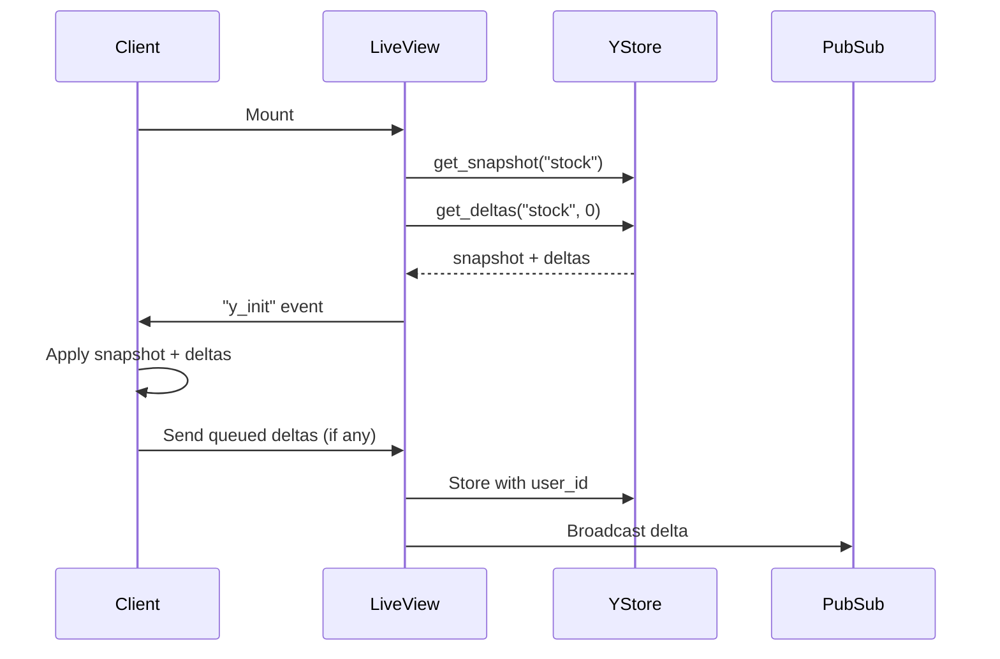
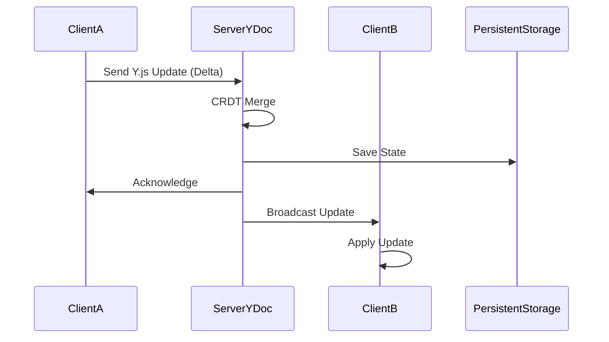
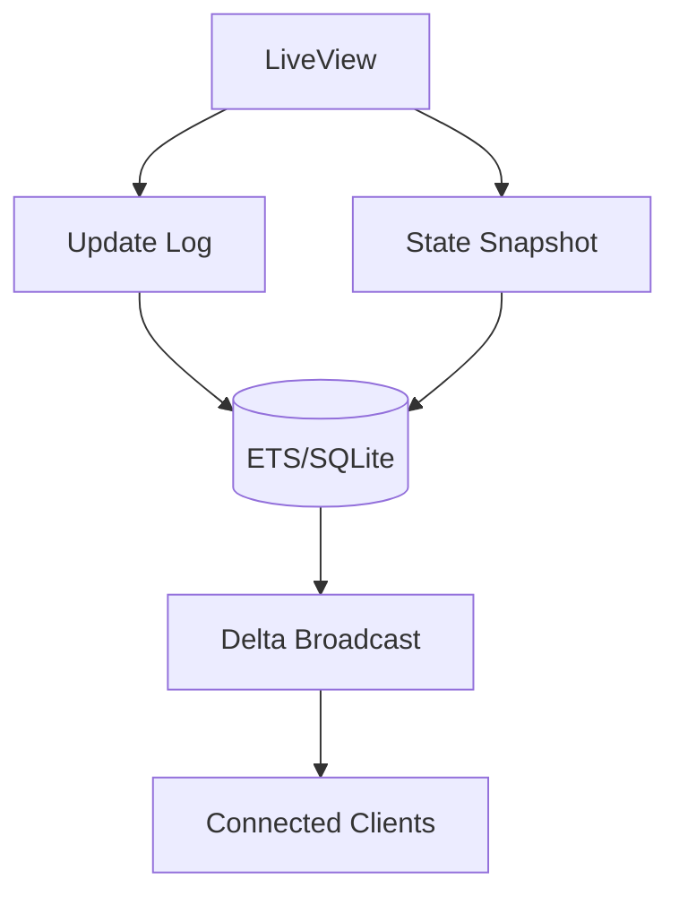
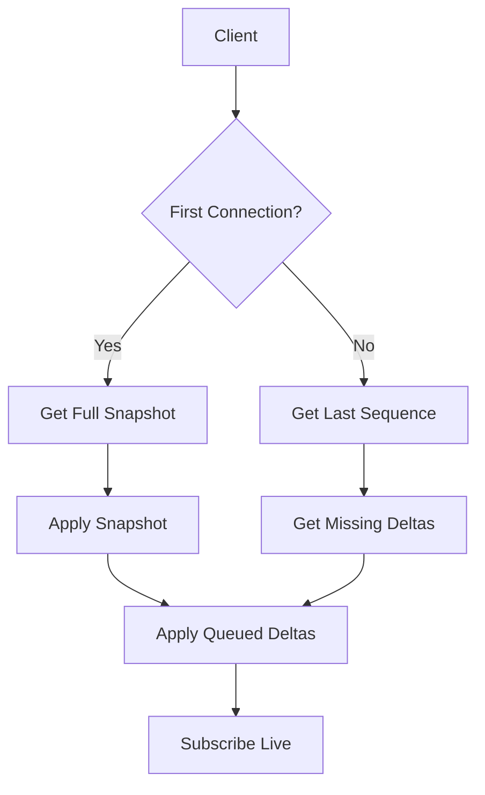

# Solidyjs

An Elixir-LiveView webapp with a real-time collaborative system with offline support (PWA).

Ingredients are:

- `Phoenix LiveView`
- [`Y.js` & `y-indexeddb`] or [`Valtio` & `localStorage`]
- `Vite`-plugin-PWA & `Workbox`
- `SolidJS`
- `Leafletjs`& MapTiler (for vector tiles)

## CSP evaluator

<https://csp-evaluator.withgoogle.com/>

## Guide

<https://vite-pwa-org.netlify.app/guide/>

### Offline Support

A service worker acts like a proxy that persists your HTML/JS/CSS in the web browser.
When all data is persisted using service workers,
you can even load your website without internet access.

Y.js's `IndexedDB` persistence handles offline support automatically.

When offline:

- Users can still modify the stock locally
- Changes are stored in IndexedDB
- When back online, YJS will sync changes

#### Flows

### GET `HEAD`connection check request

Avoids downloading the body, The server returns the HTTP headers, so no headers, no connection.

- `navigator.onLine` has limitations. After navigating offline, the browser incorrectly reports `navigator.onLine = true`. This prevents the online event from firing on reconnection.

For a reliable State Detection: The online and offline events alone cannot always determine connectivity, especially when the server is unreachable.

For a reliable State Detection:, one can implement a custom Polling: a server reachability check (via HEAD requests) ensures accurate detection of reconnection, independent of browser state.

This is done by running `setInterval`

Efficient Reloads: Using a reloaded flag in the polling logic allows the app to reload once on reconnection, avoiding redundant reloads or unnecessary complexity.

This approach ensures consistent synchronization of client and server states while maintaining accurate offline/online indicators.

### Airports list

Link: <https://openflights.org/data.php>

URL: <https://raw.githubusercontent.com/jpatokal/openflights/master/data/airports.dat>

#### Fields

- Airport ID: Unique OpenFlights identifier for this airport.
- Name: Name of airport. May or may not contain the City name.
- City: Main city served by airport. May be spelled differently from Name.
- Country: Country or territory where airport is located. See Countries to cross-reference to ISO 3166-1 codes.
- IATA: 3-letter IATA code. Null if not assigned/unknown.
- ICAO: 4-letter ICAO code.
- Latitude: Decimal degrees, usually to six significant digits. Negative is South, positive is North.
- Longitude: Decimal degrees, usually to six significant digits. Negative is West, positive is East.
- Altitude: In feet.
- DST: Daylight savings time. One of E (Europe), A (US/Canada), S (South America), O (Australia), Z (New Zealand), N (None) or U (Unknown). See also: Help: Time
- Tz: database timezone Timezone in "tz" (Olson) format, eg. "America/Los_Angeles".
- Type: Type of the airport. Value "airport" for air terminals, "station" for train stations, "port" for ferry terminals and "unknown" if not known. In airports.csv, only type=airport is included.
- Source
