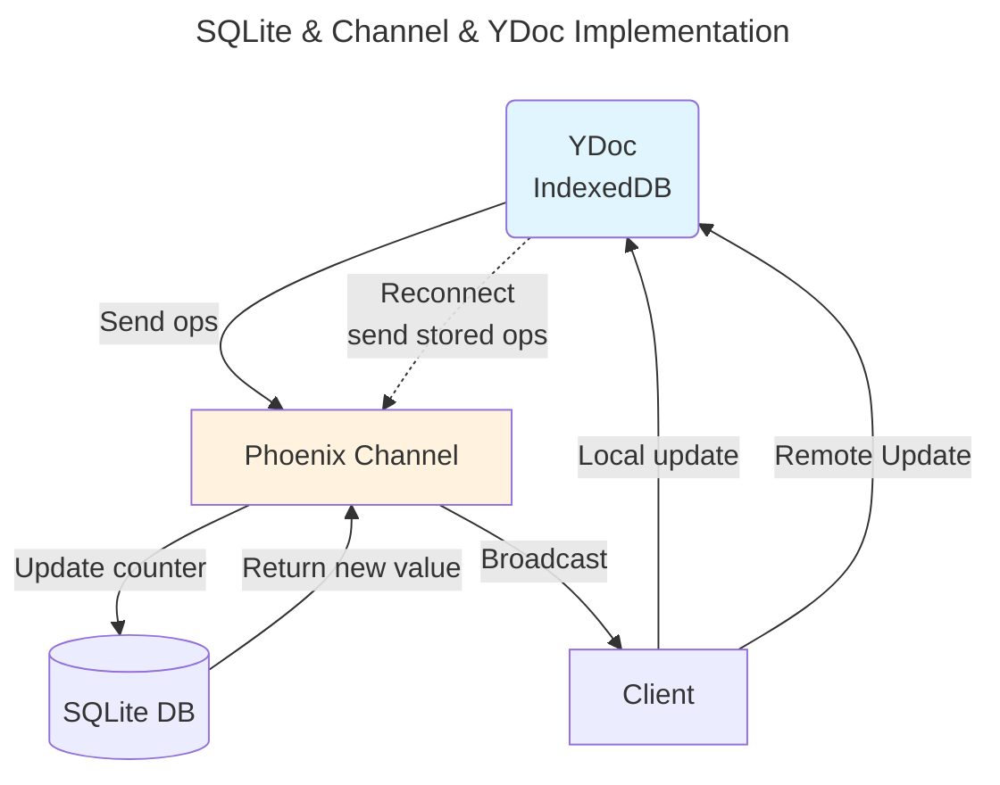
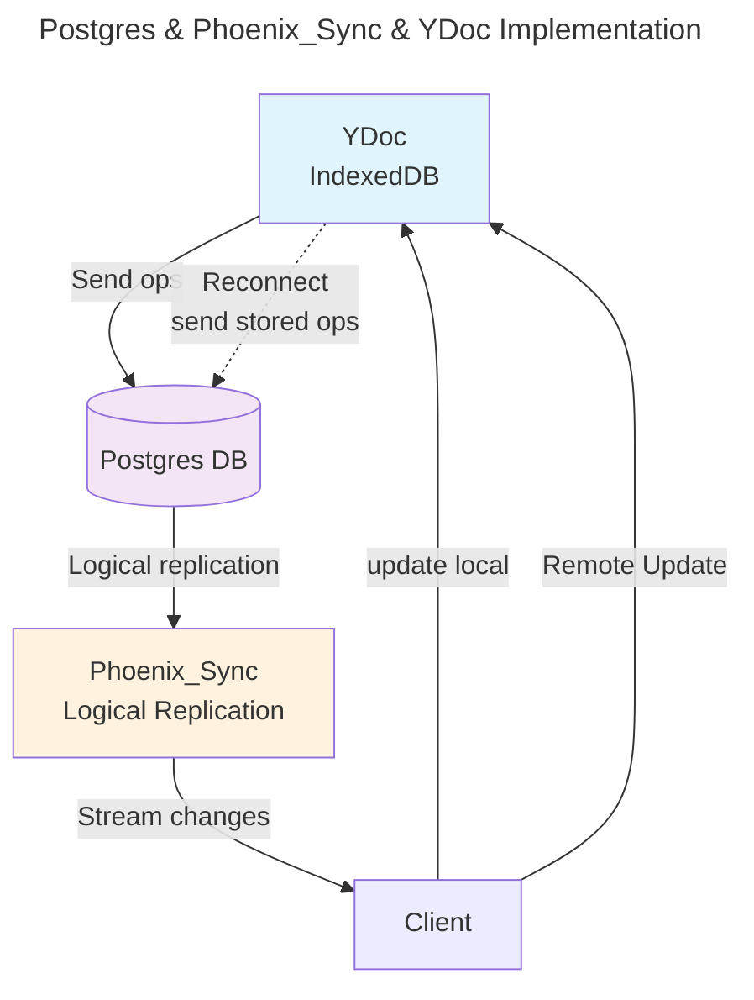
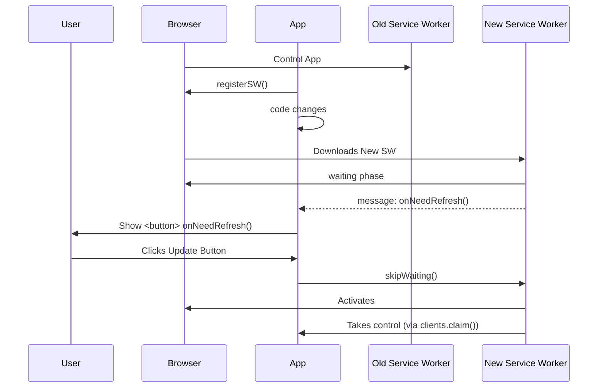
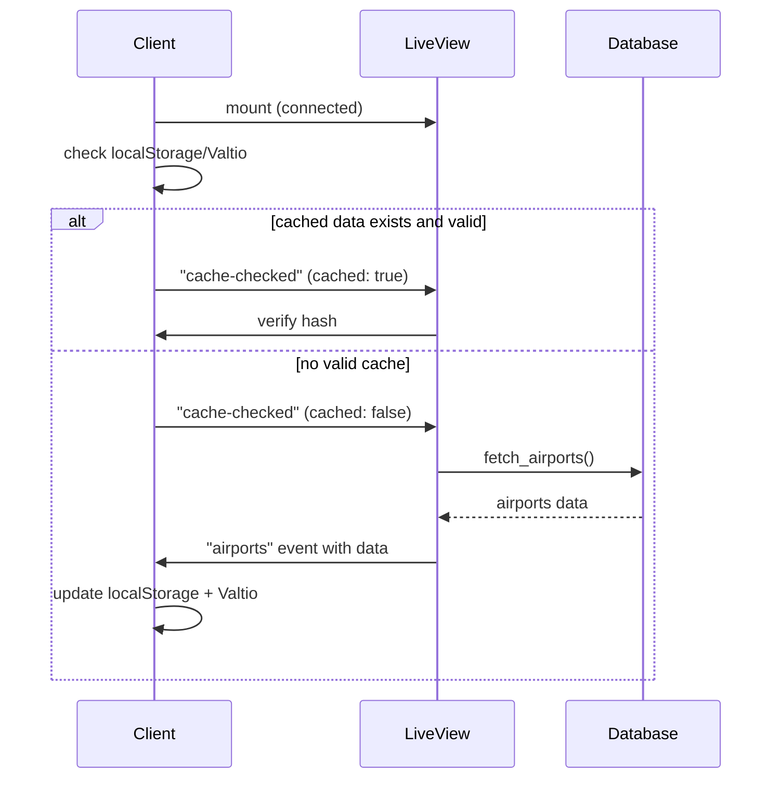

# Offline first Phoenix LiveView PWA

An example of a real-time, collaborative multi-page web app built with `Phoenix LiveView` designed for offline-first ready; it is packaged as a [PWA](https://developer.mozilla.org/en-US/docs/Web/Progressive_web_apps).

While the app supports full offline interaction and local persistence using CRDTs (via `Yjs` and `y-indexeddb`), the core architecture is still grounded in a server-side source of truth. The server database ultimately reconciles all updates, ensuring consistency across clients.

This design enables:

✅ Full offline functionality and interactivity

✅ Real-time collaboration between multiple users

✅ Reconciliation with a central, trusted source of truth when back online

In this demo, we have a _centralized authoritative server_. We use:

## Architecture at a glance

- Client-side CRDTs (`Yjs`) manage local state changes (e.g. counter updates), even when offline
- Server-side database (`Postgres` or `SQLite`) remains authoritative
- When the client reconnects, local CRDT updates are synced with the server:

  - In one page, via `Postgres` and `Phoenix_Sync` wit logical replication
  - In another, via `SQLite` using a `Phoenix Channel` message

- Offline first solutions naturally offloads the reactive UI logic to JavaScript. We used `SolidJS`.
- It uses `Vite` as the bundler. The `vite-plugin-pwa` registers a Service Worker to cache app shell and assets for offline usage.

## How it works

### Optimistic Updates with Centralized Reconciliation

Although we leverage Yjs (a CRDT library) under the hood, this isn’t a fully peer-to-peer, decentralized CRDT system. Instead, in this demo we have:

- No direct client-to-client replication (not pure lazy/optimistic replication).
- No concurrent writes against the same replica—all operations are serialized through the server.

Writes are _serialized_ but actions are concurrent. What we do have is _asynchronous reconciliation_ with an [operation-based CRDT](https://en.wikipedia.org/wiki/Conflict-free_replicated_data_type#Counters) approach:

- User actions (e.g. clicking “decrement” on the counter) are applied locally to a `Yjs` document stored in `IndexedDB`.
- The same operation (not the full value) is sent to the server via `Phoenix` (either `Phoenix_Sync` or a `Channel`).
- `Phoenix` broadcasts that op to all connected clients.
- Upon receipt, each client applies the op to its local `Yjs` document—order doesn’t matter, making it commutative.
- The server database (Postgres or SQLite) remains the single source of truth and persists ops in sequence.

> In CRDT terms: We use an operation-based CRDT (CRDT Counter) for each shared value Ops commute (order-independent) even though they pass through a central broker.

### Rendering Strategy: SSR vs. Client-Side Hooks

To keep the UI interactive both online and offline, we mix `LiveView`’s server-side rendering (SSR) with a client-side reactive framework:

- Online (`LiveView` SSR or Hooks)

  - `LiveView` renders the initial HTML on the server.
  - A `LiveView` hook (`JavaScript`) attaches to the counter element and initializes a `SolidJS` component.
  - As ops flow in/out over the LiveSocket, `SolidJS` updates the DOM reactively.

- Offline (Manual Rendering)

  - The Service Worker serves the cached HTML & JS bundle.
  - LiveSocket is disconnected, so `LiveView` hooks can’t drive updates.
  - We detect offline status and manually mount the same `SolidJS` component using our "navigate.js" utility.
  - The component reads from the local `Yjs`+`IndexedDB` replica and remains fully interactive.

### Service Worker & Asset Caching

`vite-plugin-pwa` generates a Service Worker that:

- Pre-caches the app shell (HTML, CSS, JS) on install.
- Intercepts navigations to serve the cached app shell for offline-first startup.

This ensures the entire app loads reliably even without network connectivity.

## Results

Deployed on `Fly.io`: <https://liveview-pwa.fly.dev/yjs/>

## Table of Contents

- [Offline first Phoenix LiveView PWA](#offline-first-phoenix-liveview-pwa)
  - [Architecture at a glance](#architecture-at-a-glance)
  - [How it works](#how-it-works)
    - [Optimistic Updates with Centralized Reconciliation](#optimistic-updates-with-centralized-reconciliation)
    - [Rendering Strategy: SSR vs. Client-Side Hooks](#rendering-strategy-ssr-vs-client-side-hooks)
    - [Service Worker \& Asset Caching](#service-worker--asset-caching)
  - [Results](#results)
  - [Table of Contents](#table-of-contents)
  - [What?](#what)
  - [Why?](#why)
  - [Design goals](#design-goals)
  - [Common pitfall of combining LiveView with CSR components](#common-pitfall-of-combining-liveview-with-csr-components)
  - [Tech overview](#tech-overview)
    - [Implementation highlights](#implementation-highlights)
  - [About the Yjs-Stock page](#about-the-yjs-stock-page)
  - [About PWA](#about-pwa)
    - [Updates life-cycle](#updates-life-cycle)
  - [Usage](#usage)
  - [Details of Pages](#details-of-pages)
    - [Yjs-Ch and PhxSync stock "manager"](#yjs-ch-and-phxsync-stock-manager)
    - [Pg-Sync-Stock](#pg-sync-stock)
    - [FlightMap](#flightmap)
  - [Navigation](#navigation)
  - [Vite](#vite)
    - [Configuration and settings](#configuration-and-settings)
      - [Watcher](#watcher)
      - [Tailwind](#tailwind)
      - [Client Env](#client-env)
    - [Static assets](#static-assets)
    - [VitePWA plugin and Workbox Caching Strategies](#vitepwa-plugin-and-workbox-caching-strategies)
  - [Yjs](#yjs)
  - [Misc](#misc)
    - [Presence through Live-navigation](#presence-through-live-navigation)
    - [CSP rules and evaluation](#csp-rules-and-evaluation)
    - [Icons](#icons)
    - [Manifest](#manifest)
    - [Performance](#performance)
    - [\[Optional\] Page Caching](#optional-page-caching)
  - [Publish](#publish)
  - [Fly volumes](#fly-volumes)
  - [Documentation source](#documentation-source)
  - [Resources](#resources)
  - [License](#license)
  - [Credits](#credits)

## What?

**Context**: we want to experiment PWA collaborative webapps using Phoenix LiveView.

What are we building? A three pages webap:

1. We mimic a stock manager in two versions. Every user can pick from the stock which is broadcasted and synced to the databased. The picked amounts are cumulated when offline and the database is synced and state reconciliation.
   - PgSync-Stock page features `phoenix_sync` in _embedded_ mode streaming logical replicates of a Postgres table.
   - Yjs-Channel page features 'Sqlite` used as a backup via a Channel.
2. FlightMap. This page proposes an interactive map with a form with two inputs where **two** users can edit collaboratively a form to display markers on the map and then draw a great circle between the two points.

## Why?

Traditional Phoenix LiveView applications face several challenges in offline scenarios:

LiveView's WebSocket architecture isn't naturally suited for PWAs, as it requires constant connection for functionality.

It is challenging to maintain consistent state across network interruptions between the client and the server.

Since we need to setup a Service Worker to cache HTML pages and static assets to work offline, we need a different bundler from the one used by default with `LiveView`.

## Design goals

- **collaborative** (online): Clients sync via _pubsub updates_ when connected, ensuring real-time consistency.
- **optimistic UI**: The function "click on stock" assumes success and will reconciliate later.
- **database**:
  - We use `SQLite` as the "canonical" source of truth for the Yjs-Stock counter.
  - `Postgres` is used for the `Phoenix_sync` process for the PgSync-Stock counter.
- **Offline-First**: The app remains functional offline (through the `Cache` API and reactive JS components), with clients converging to the correct state on reconnection.
- **PWA**: Full PWA features, meaning it can be _installed_ as a standalone app and can be _updated_. A `Service Worker` runs in a separate thread and caches the assets. It is setup with `VitePWA`.

## Common pitfall of combining LiveView with CSR components

The client-side rendered components are - when online - mounted via hooks under the tag `phx-update="ignore"`.

These components have they own lifecycle. They can leak or stack duplicate components if you don't cleanup them properly.
The same applies to "subscriptions/observers" primitives from (any) the state manager. You must _unsubscribe_, otherwise you might get multiples calls and weird behaviours.

⭐️ LiveView hooks comes with a handy lifecyle and the `destroyed` callback is essential.

`SolidJS` makes this easy as it can return a `cleanupSolid` callback (where you take a reference to the SolidJS component in the hook).
You also need to clean _subscriptions_ (when using a store manager).

The same applies when you navigate offline; you have to run cleanup functions, both on the components and on the subsriptions/observers from the state manager.

## Tech overview

| Component                  | Role                                                                                                              |
| -------------------------- | ----------------------------------------------------------------------------------------------------------------- |
| Vite                       | Build and bundling framework                                                                                      |
| SQLite                     | Embedded persistent storage of latest Yjs document                                                                |
| Postgres                   | Supports logical replication                                                                                      |
| Phoenix LiveView           | UI rendering, incuding hooks                                                                                      |
| Phoenix_sync               | Relays Psotgres streams into LiveView                                                                             |
| PubSub / Phoenix.Channel   | Broadcast/notifies other clients of updates / conveys CRDTs binaries on a separate websocket (from te LiveSocket) |
| Yjs / Y.Map                | Holds the CRDT state client-side (shared)                                                                         |
| y-indexeddb                | Persists state locally for offline mode                                                                           |
| Valtio                     | Holds local ephemeral state                                                                                       |
| Hooks                      | Injects communication primitives and controls JavaScript code                                                     |
| Service Worker / Cache API | Enable offline UI rendering and navigation by caching HTML pages and static assets                                |
| SolidJS                    | renders reactive UI using signals, driven by Yjs observers                                                        |
| Leaflet                    | Map rendering                                                                                                     |
| MapTiler                   | enable vector tiles                                                                                               |
| WebAssembly container      |  high-performance calculations for map "great-circle" routes use `Zig` code compiled to `WASM`                    |

### Implementation highlights

We use different approaches based on the page requirements:

1. Yjs-Channel: the counter is a reactive component rendered via a hook by `SolidJS`. When offline, we render the component directly.
2. PhxSync: the counter is rendered by LiveView and receives `Psotgres` streams. When offline, we render the exact same component directly.
3. The source of truth is the database. Every client has a local replica (`IndexedDB`) which handles offline changes and gets updates when online.
4. FlightMap. Local state management (`Valtio`) for the collaborative Flight Map page without server-side persistence of the state nor client-side.

- **Build tool**:
  We use Vite as the build tool to bundle and optimize the application and enable PWA features seamlessly.
  The Service Worker to cache HTML pages and static assets.

- **reactive JS components**:
  Every reactive component works in the following way. Local changes fomr within the component mutate YDoc and an `yjs`-listener will update the component state to render. Any received remote change mutates the `YDoc`, thus triggers the component rendering.

- **FlightMap page**:
  We use a local state manager (`Valtio` using proxies).
  The inputs (selected airports) are saved to a local state.
  Local UI changes mutate the state and are sent to the server. The server broadcasts the data.
  We have state observers which update the UI if the origin is not remote.

- **Component Rendering Strategy**:
  - online: use LiveView hooks
  - offline: hydrate the HTML with cached documents and run reactive JavaScript components

## About the Yjs-Stock page



<br/>



## About PWA

A Progressive Web App (PWA) is a type of web application that provides an app-like experience directly in the browser.

It has:

- offline support
- is "installable":


<br/>

The core components are setup using `Vite` in the _vite.config.js_ file.

- **Service Worker**:
  A background script - separate thread - that acts as a proxy: intercepts network requests and enables offline caching and background sync.
  We use the `VitePWA` plugin to enable the Service Worker life-cycle (manage updates)

- Web App **Manifest** (manifest.webmanifest)
  A JSON file that defines the app’s name, icons, theme color, start URL, etc., used to install the webapp.
  We produce the Manifest with `Vite` via in the "vite.

- HTTPS (or localhost):
  Required for secure context: it enables Service Workers and trust.

`Vite` builds the SW for us via the `VitePWA` plugin by declarations in "vite.config.js". Check [Vite](#vite)

The SW is started by the main script, early, and must preload all the build static assets as the main file starts before the SW runtime caching is active.

Since we want offline navigation, we precache the rendered HTML as well.

### Updates life-cycle

A Service Worker (SW) runs in a _separate thread_ from the main JS and has a unique lifecycle made of 3 key phases: install / activate / fetch

In action:

1. Make a change in the client code, git push/fly deploy:
   -> a button appears and the dev console shows a push and waiting stage:


<br/>

2. Click the "refresh needed"
   -> the Service Worker and client claims are updated seamlessly, and the button is in the hidden "normal" state.


</br>

Service Workers don't automatically update unless:

- The sw.js file has changed (based on byte comparison).

- The browser checks periodically (usually every 24 hours).

- When a new SW is detected:

  - New SW enters installing state.

  - It waits until no existing clients are using the old SW.

  - Then it activates.



## Usage

```elixir
# mix.exs
{:exqlite, "0.30.1"},
{:req, "~> 0.5.8"},
{:nimble_csv, "~> 1.2"},
{:postgrex, "~> 0.20.0"},
{:electric, "~> 1.0.13"},
{:phoenix_sync, "~> 0.4.3"},
```

Client package are setup with `pnpm`: check [▶️ package.json](https://github.com/dwyl/PWA-Liveview/blob/main/assets/package.json)

1/ **dev** setup with _IEX_ session

```sh
# install all dependencies including Vite
mix deps.get
mix ecto.create && mix ecto.migrate
pnpm install --prefix assets
# start Phoenix server, it will also compile the JS
iex -S mix phx.server
```

2/ Run a local Docker container in **mode=prod**

Firstly setup Postgres in _logical replication_ mode.

```yml
services:
  pg:
    image: postgres:17
    container_name: pg17
    environment:
      # PostgreSQL environment variables are in the form POSTGRES_*
      POSTGRES_PASSWORD: 1234
      POSTGRES_USER: postgres
      POSTGRES_DB: elec_prod
    healthcheck:
      test: ["CMD-SHELL", "pg_isready -U postgres"] # <- !! admin user is "postgres"
      interval: 5s
      timeout: 5s
      retries: 10
    volumes:
      - pgdata:/var/lib/postgresql/data
    ports:
      - "5000:5432"

    command: # <- set variables via a command
      - -c
      - listen_addresses=*
      - -c
      - wal_level=logical
      - -c
      - max_wal_senders=10
```

<br/>

This also opens the port 5000 for inspection via the `psql` client.

In another terminal, you can do:

```sh
> PGPASSWORD=1234 psql -h localhost -U postgres -d elec_prod -p 5000

# psql (17.5 (Postgres.app))
# Type "help" for help.

elec_prod=#
```

and paste the command to check:

```sh
elec_prod=# select name, setting from pg_settings where name in ('wal_level','max_worker_processes','max_replication_slots','max_wal_senders','shared_preload_libraries');
           name           | setting
--------------------------+---------
 max_replication_slots    | 10
 max_wal_senders          | 10
 max_worker_processes     | 8
 shared_preload_libraries |
 wal_level                | logical
(5 rows)
```

You can run safely (meaning the migrations will run or not, and complete):

[▶️ Dockerfile](https://github.com/dwyl/PWA-Liveview/blob/main/Dockerfile)

[▶️ docker-compose.yml](https://github.com/dwyl/PWA-Liveview/blob/main/docker-compose.yml)

```sh
docker compose up --build
```

> You can take a look at the build artifacts by running into another terminal

```sh
> docker compose exec -it web cat  lib/solidyjs-0.1.0/priv/static/.vite/manifest.json
```

## Details of Pages

### Yjs-Ch and PhxSync stock "manager"

You click on a counter and it goes down..! The counter is broacasted and handled by a CRDT backed into a SQLite table.
A user can click offline, and on reconnection, all clients will get updated with the lowest value (business rule).


<br/>

### Pg-Sync-Stock

Available at "/elec"

### FlightMap

Available at `/map`.

It displays an _interactive_ and _collaborative_ (two-user input) route planning with vector tiles.
The UI displays a form with two inputs, which are pushed to Phoenix and broadcasted via Phoenix PubSub. A marker is drawn by `Leaflet` to display the choosen airport on a vector-tiled map using `MapTiler`.


<br/>

Key features:

- collaborative input
- `Valtio`-based _local_ (browser only) ephemeral state management (no complex conflict resolution needed)
- WebAssembly-powered great circle calculations: CPU-intensive calculations works offline
- Efficient map rendering with MapTiler and _vector tiles_ with smaller cache size (vector data vs. raster image files)

> [**Great circle computation**] It uses a WASM module. `Zig` is used to compute a "great circle" between two points, as a list of `[lat, long]` spaced by 100km. The `Zig` code is compiled to WASM and available for the client JavaScript to run it. Once the list of successive coordinates are in JavaScript, `Leaflet` can use it to produce a polyline and draw it into a canvas. We added a WASM module to implement great circle route calculation as a showcase of WASM integration. A JAvascript alternative would be to use [turf.js](https://turfjs.org/docs/api/greatCircle).
> check the folder "/zig-wasm"

> [**Airport dataset**] We use a dataset from <https://ourairports.com/>. We stream download a CSV file, parse it (`NimbleCSV`) and bulk insert into an SQLite table. When a user mounts, we read from the database and pass the data asynchronously to the client via the liveSocket on the first mount. We persist the data in `localStorage` for client-side search. The socket "airports" assign is then pruned to free the server's socket.

▶️ [Airports](<(https://github.com/dwyl/PWA-Liveview/blob/main/lib/LiveviewPwa/db/Airports.ex)>), [LiveMap](https://github.com/dwyl/PWA-Liveview/blob/main/lib/LiveviewPwaweb/live/live_map.ex)

> The Websocket is configured with `compress: true` (cf <https://hexdocs.pm/phoenix/Phoenix.Endpoint.html#socket/3-websocket-configuration>) to enable compression of the 1.1MB airport dataset through the LiveSocket.

Below a diagram showing the flow between the database, the server and the client.



## Navigation

The user use "live navigation" when online between two pages which use the same _live_session_, with no full page reload.

When the user goes offline, we have the same smooth navigation thanks to navigation hijack an the HTML and assets caching, as well as the usage of `y-indexeddb`.

When the user reconnects, we have a full-page reload.

**Lifecycle**:

- Initial Load: App start the LiveSocket and attaches the hooks. It will then trigger a continous server check.
- Going Offline: Triggers component initialization and navigation setup
- Navigating Offline: cleans up components, _fetch_ the cached pages (request proxied by the SW and the page are cached iva the `additionalManifestEntries`), parse ahd hydrate the DOM to renders components
- Going Online: when the polling detects a transistion off->on, the user expects a page refresh and Phoenix LiveView reinitializes.

**Key point**:

- ⚠️ **memory leaks**:
  With this offline navigation, we never refresh the page. As said before, reactive components and subscriptions need to be cleaned before disposal. We store the cleanup functions and the subscriptions.

## Vite

### Configuration and settings

All the client code is managed by `Vite` and done (mostly) in a declarative way in the file [vite.config.js](https://github.com/dwyl/PWA-Liveview/blob/main/assets/vite.config.js).

> Most declarations are done programatically as it is run by `NodeJS`.

#### Watcher

There is a watcher configured in "config/dev.exs" which replaces, thus removes, `esbuild` and `tailwindCSS` (which are also removed from the mix deps).

```elixir
watchers: [
    npx: [
      "vite",
      "build",
      "--mode",
      "development",
      "--watch",
      "--config",
      "vite.config.js",
      cd: Path.expand("../assets", __DIR__)
    ]
  ]
```

#### Tailwind

⚠️You can't use v4 but should _keep v3.4_. Indeed, Tailwind v4 drops the "tailwind.config.js" and there is no proper way to parse the SSR files (.ex, .heex) without it.

Tailwind is used as a PostCSS plugin. In the `Vite` config, it is set with the declaration:

```js
import tailwindcss from "tailwindcss";
[...]
// in `defineConfig`, add:
css: {
  postcss: {
    plugins: [tailwindcss()],
  },
},
```

and reads automatically the "tailwind.configjs" which sits next to "vite.config.js".

> Note. We use `lightningCSS` for further optimze the CSS and `autoprefixer` is built in (if "-weebkit" for flex/grid or "-moz" for transitions are needed).

#### Client Env

The env arguments are loaded with `loadEnv`.

1. Runtime access: `import.meta.env`
   The client env vars are set in the ".env" placed, placed in the "/assets" folder (origin client code) next to "vite.config.js".
   They need to be prefixed with `VITE_`.
   They is injected by `Vite` at _runtime_ when you use `import.meta.env`.
   In particular, we use `VITE_API_KEY` for `Maptiler` to render the vector tiles.

2. Compile access: `define`
   it is used at _compile time_ .
   The directive `define` is used to get _compile time_ global constant replacement. This is valuable for dead code elimination.
   For example:

   ```js
   define: {
     __API_ENDPOINT__: JSON.stringify(
       process.env.NODE_ENV === "production"
         ? "https://example.com"
         : "http://localhost:4000"
     );
   }
   [...]
   // NODE_ENV="prodution"
   // file.js
   if (__API__ENDPOINT__ !== "https://example.com") {
    // => dead code eliminated
   }
   ```

3. Docker:
   In the Docker build stage, you copy the "assets" folder.
   You therefor copy the ".env" file so the env vars variables are accessible at runtime.
   When you deploy, we need to set an env variable `VITE_API_KEY` which will be used to build the image.

### Static assets

We do not use the step `mix phx.digest` and removed from the Dockerfile.
We fingerprint and compress the static files via `Vite`.

```js
rollupOptions.output: {
  assetFileNames: "assets/[name]-[hash][extname]",
  chunkFileNames: "assets/[name]-[hash].js",
  entryFileNames: "assets/[name]-[hash].js",
},
```

We do this because we want the SW to be able to detect client code changes and update the app. The Phoenix work would interfer.

**Caveat**: versioned fils have dynamic so how to pass them to the "root.html.heex" component?

When assets are not fingerprinted, Phoenix can serve them "normally" as names are known:

```elixir
<link rel="icon" href="/favicon.ico" type="image/png" sizes="48x48" />
<link rel="manifest" href="/manifest.webmanifest" />
```

When the asset reference is versioned, we use the `.vte/manifest` dictionary to find the new name.
We used a helper [ViteHelper](https://github.com/dwyl/PWA-Liveview/blob/main/lib/soldiyjsweb/vite_helper.ex) to map the original name to the versioned one (the one in "priv/static/assets").

```elixir
<link
  phx-track-static
  rel="stylesheet"
  href={ViteHelper.path("css/app.css")}
  # href={~p"/assets/app.css"}
  crossorigin="anonymous"
/>

<script
  defer
  phx-track-static
  nonce={assigns[:main_nonce]}
  type="module"
  src={ViteHelper.path("js/main.js")}
  # src={~p"/app.css"}
  crossorigin="anonymous"
>
</script>
```

Not all assets need to be fingerprinted, such as "robotx.txt", icons.... To copy these files , we use the plugin `vite-plugin-static-copy`.

We also compress files to _ZSTD_ known for its compression performance and deflating speed. We use the plugin `vite-plugin-compression2` and use `@mongodb-js/zstd`.

We modify "endpoint.ex" to accept these encodings:

```elixir
plug Plug.Static,
  encodings: [{"zstd", ".zstd"}],
  brotli: true,
  gzip: true,
  at: "/",
  from: :liveview_pwa,
  only: ~w(
    assets
    icons
    robots.txt
    sw.js
    manifest.webmanifest
    sitemap.xml
    ),
  headers: %{
    "cache-control" => "public, max-age=31536000"
  }
  [...]
```

### VitePWA plugin and Workbox Caching Strategies

We use the [VitePWA](https://vite-pwa-org.netlify.app/guide/) plugin to generate the SW and the manifest.

The client code is loaded in a `<script>`. It will load the SW registration when the event DOMContentLoaded fires.
All of the hooks are loaded and attached to the LiveSocket, like an SPA.
If we don't _preload_ the JS files in the SW, most of the js files will never be cached, thus the app won't work offline.

For this, we define that we want to preload all static assets in the directive `globPattern`.

Once the SW activated, you should see (in dev mode):


<br/>

We also cache the rendered HTML pages as we inject them when offline, via `additionalManifestEntries`.

```js
PWAConfig = {
  // Don't inject <script> to register SW (handled manually)
  // and there no client generated "index.html" by Phoenix
  injectRegister: false, // no client generated "index.html" by Phoenix

  // Let Workbox auto-generate the service worker from config
  strategies: "generateSW",

  // App manually prompts user to update SW when available
  registerType: "prompt",

  // SW lifecycle ---
  // Claim control over all uncontrolled pages as soon as the SW is activated
  clientsClaim: true,

  // Let app decide when to update; user must confirm or app logic must apply update
  skipWaiting: false,

  workbox: {...}
}
```

❗️ It is important _not to split_ the "sw.js" file because `Vite` produces a fingerprint from the splitted files. However, Phoenix serves hardcoded nmes and can't know the name in advance.

```js
workbox: {
  // Disable to avoid interference with Phoenix LiveView WebSocket negotiation
  navigationPreload: false

  // ❗️ no fallback to "index.html" as it does not exist
  navigateFallback: null

  // ‼️ tell Workbox not to split te SW as the other is fingerprinted, thus unknown to Phoenix.
  inlineWorkboxRuntime: true,

  // preload all the built static assets
  globPatterns: ["assets/**/*.*"],

  // cached the HTML for offline rendering
  additionalManifestEntries: [
    { url: "/", revision: `${Date.now()}` }, // Manually precache root route
    { url: "/map", revision: `${Date.now()}` }, // Manually precache map route
  ],

}
```

For the Service Worker lifecycle, set:

```js
defineConfig = {
  // Disable default public dir (using Phoenix's)
  publicDir: false,
};
```

## Yjs

[TODO something smart...?]

## Misc

### Presence through Live-navigation

It is implemented using a `Channel` and a `JavaScript` snippet used in the main script.

The reason is that if we implement it with "streams", it will wash away the current stream
used by `Phoenix_sync`.

It also allows to minimise rendering when navigating to the different Liveviews.

The relevant module is: `setPresenceChannel.js`. It uses a reactive JS component (`SolidJS`).
It returns a "dispose" and an "update" function.

This snippet runs in "main.js".
The key points are:

- a simple Channel with `Presence.track` and a `push` of the `Presence.list`,
- use `presence.onSync` listener to get a `Presence` list up-to-date and render the UI with this list
- a `phx:page-loading-stop` listener to udpate the UI when navigating between Liveviews because we target DOM elements to render the reactive component.

### CSP rules and evaluation

The application implements security CSP headers set by a plug: `BrowserCSP`.

We mainly protect the "main.js" file - run as a script in the "root.html" template - is protected with a **dynamic nonce**.

<details>
<summary>Detail of dynamic nonce</summary>

```elixir
defmodule SoldiyjsWeb.BrowserCSP do
  @behaviour Plug

  def init(opts), do: opts

  def call(conn, _opts) do
    nonce = :crypto.strong_rand_bytes(16) |> Base.encode16(case: :lower)
    Plug.Conn.assign(conn, :csp_nonce, nonce)
  end
end
```

````elixir
# root.html.heex
<script nonce="<%= assigns[:csp_nonce] %>">
  // Your inline script here
</script>

```elixir
defp put_csp_headers(conn) do
  nonce = conn.assigns[:csp_nonce] || ""

  csp_policy = """
  script-src 'self' 'nonce-#{nonce}' 'wasm-unsafe-eval' https://cdn.maptiler.com;
  object-src 'none';
  connect-src 'self' http://localhost:* ws://localhost:* https://api.maptiler.com https://*.maptiler.com;
  img-src 'self' data: https://*.maptiler.com https://api.maptiler.com;
  worker-src 'self' blob:;
  style-src 'self' 'unsafe-inline';
  default-src 'self';
  frame-ancestors 'self' http://localhost:*;
  base-uri 'self'
  """
  |> String.replace("\n", " ")

  put_resp_header(conn, "content-security-policy", csp_policy)
end
````

</details>

The nonce-xxx attribute is an assign populated in the plug BrowserCSP.
Indeed, the "root" template is rendered on the first mount, and has access to the `conn.assigns`.

➡️ Link to check the endpoint: <https://csp-evaluator.withgoogle.com/>

<br/>

<br/>

The WASM module needs `'wasm-unsafe-eval'` as the browser runs `eval`.

### Icons

You will need is to have at least two very low resolution icons of size 192 and 512, one extra of 180 for OSX and one 62 for Microsoft, all placed in "/priv/static".

Check [Resources](#resources)

### Manifest

The "manifest.webmanifest" file will be generated from "vite.config.js".

Source: check [PWABuilder](https://www.pwabuilder.com)

```json
{
  "name": "LivePWA",
  "short_name": "LivePWA",
  "start_url": "/",
  "display": "standalone",
  "background_color": "#ffffff",
  "lang": "en",
  "scope": "/",
  "description": "A Phoenix LiveView PWA demo app",
  "theme_color": "#ffffff",
  "icons": [
    { "src": "/images/icon-192.png", "sizes": "192x192", "type": "image/png" },
    ...
  ]
}
```

✅ Insert the links to the icons in the (root layout) HTML:

```html
<!-- root.html.heex -->
<head>
  [...] <link rel="icon-192" href={~p"/icons/icon-192.png"} /> <link
  rel="icon-512" href={~p"/icons/icon-512.png"} /> [...] <link rel="manifest"
  href={~p"/manifest.webmanifest"} /> [...]
</head>
```

### Performance

Lighthouse results:

<div align="center"></div>

### [Optional] Page Caching

<details>
<summary>Direct usage of Cache API instead of Workbox</summary>

We can use the `Cache API` as an alternative to `Workbox` to cache pages. The important part is to calculate the "Content-Length" to be able to cache it.

> Note: we cache a page only once by using a `Set`

```javascript
// Cache current page if it's in the configured routes
async function addCurrentPageToCache({ current, routes }) {
  await navigator.serviceWorker.ready;
  const newPath = new URL(current).pathname;

  // Only cache configured routes once
  if (!routes.includes(newPath) || AppState.paths.has(newPath)) return;

  if (newPath === window.location.pathname) {
    AppState.paths.add(newPath);
    const htmlContent = document.documentElement.outerHTML;
    const contentLength = new TextEncoder().encode(htmlContent).length;

    const response = new Response(htmlContent, {
      headers: {
        "Content-Type": "text/html",
        "Content-Length": contentLength,
      },
      status: 200,
    });

    const cache = await caches.open(CONFIG.CACHE_NAME);
    return cache.put(current, response);
  }
}

// Monitor navigation events
navigation.addEventListener("navigate", async ({ destination: { url } }) => {
  return addCurrentPageToCache({ current: url, routes: CONFIG.ROUTES });
});
```

</Details>
</br>

## Publish

The site <https://docs.pwabuilder.com/#/builder/android> helps to publish PWAs on Google Play, Ios and other plateforms.

## Fly volumes

In the "fly.toml", the settings for the volume are:

```toml
[env]
DATABASE_PATH = '/mnt/db/main.db'
MIX_ENV = 'prod'
PHX_HOST = 'solidyjs-lively-pine-4375.fly.dev'
PORT = '8080'

[[mounts]]
source = 'name'
destination = '/mnt/db'
```

This volume is made persistent through build with `source = 'name'`.
We set the Fly secret: `DATABASE_PATH=mnt/db/main.db`.

## Documentation source

- Update API: <https://docs.yjs.dev/api/document-updates#update-api>
- Event handler "on": <https://docs.yjs.dev/api/y.doc#event-handler>
- local persistence with IndexedDB: <https://docs.yjs.dev/getting-started/allowing-offline-editing>
- Transactions: <https://docs.yjs.dev/getting-started/working-with-shared-types#transactions>
- Map shared type: <https://docs.yjs.dev/api/shared-types/y.map>
- observer on shared type: <https://docs.yjs.dev/api/shared-types/y.map#api>

## Resources

Besides Phoenix LiveView:

- [Yex with Channel](https://github.com/satoren/y-phoenix-channel)
- [Yjs Documentation](https://docs.yjs.dev/)
- [Vite PWA Plugin Guide](https://vite-pwa-org.netlify.app/guide/)
- [MDN PWA](https://developer.mozilla.org/en-US/docs/Web/Progressive_web_apps/Guides/Best_practices)
- [PWA builder](https://www.pwabuilder.com/reportcard?site=https://solidyjs-lively-pine-4375.fly.dev/)
- [Favicon Generator](https://favicon.inbrowser.app/tools/favicon-generator) and <https://vite-pwa-org.netlify.app/assets-generator/#pwa-minimal-icons-requirements>
- [CSP Evaluator](https://csp-evaluator.withgoogle.com/)
- [Haversine formula](https://en.wikipedia.org/wiki/Haversine_formula)

## License

[GNU License](LICENSE)

## Credits

To enhance this project, you may want to use `y_ex`, the `Elixir` port of `y-crdt`.

Cf [Satoren](https://github.com/satoren) for [Yex](https://github.com/satoren/y_ex)
