# Phoenix LiveView + SolidJS PWA

An example of a Progressive Web App (PWA) combining Phoenix LiveView's real-time capabilities with SolidJS's reactive UI for offline-first collaboration.

## Table of Contents

- [Phoenix LiveView + SolidJS PWA](#phoenix-liveview--solidjs-pwa)
  - [Table of Contents](#table-of-contents)
  - [Key points](#key-points)
  - [Why?](#why)
  - [Usage](#usage)
  - [Tech overview](#tech-overview)
  - [State management](#state-management)
    - [What is `Yjs`?](#what-is-yjs)
    - [Phoenix.Channel and CRDT state merge conflicts](#phoenixchannel-and-crdt-state-merge-conflicts)
    - [Yjs data flow](#yjs-data-flow)
  - [Demo Pages](#demo-pages)
    - [Stock Manager](#stock-manager)
    - [Flight Map](#flight-map)
      - [Collaborative input](#collaborative-input)
      - [Client state management](#client-state-management)
      - [Great circle computation with a WASM module](#great-circle-computation-with-a-wasm-module)
      - [Airport dataset](#airport-dataset)
    - [Navigation](#navigation)
  - [Implementation](#implementation)
    - [Build Tool: `Vite` vs `Esbuild`](#build-tool-vite-vs-esbuild)
    - [WebAssembly Integration](#webassembly-integration)
    - [Vector Tiles](#vector-tiles)
    - [\[Optional\] Page Caching](#optional-page-caching)
    - [Configuration and settings](#configuration-and-settings)
      - [PWA and Workbox Caching Strategies](#pwa-and-workbox-caching-strategies)
      - [Server configuration](#server-configuration)
      - [Phoenix settings: dev build and watcher](#phoenix-settings-dev-build-and-watcher)
      - [CSP rules and evaluation](#csp-rules-and-evaluation)
    - [Yjs](#yjs)
      - [Documentation source](#documentation-source)
      - [Yjs initialization](#yjs-initialization)
      - [**UI layer**: a `SolidJS` component](#ui-layer-a-solidjs-component)
    - [Server-Side Implementation](#server-side-implementation)
    - [State Synchronization Flow](#state-synchronization-flow)
    - [Misc](#misc)
      - [Common pitfall of combining LiveView with CSR components](#common-pitfall-of-combining-liveview-with-csr-components)
      - ["Important" `Workbox` settings](#important-workbox-settings)
      - [Icons](#icons)
      - [Manifest](#manifest)
    - [Performance](#performance)
  - [Resources](#resources)
  - [License](#license)

## Key points

The webapp works offline with a Service Worker (features `Workbox`). It is built with `Vite` plugins.

We used `Vite` to build the client code (which uses `Esbuild` and `rollUp`).

We used `Y.js` with `y-indexeddb` to manage the authoritative state client-side.
We used `y_ex` to manage the mirrored state server-side, and `SQLite3` to persist the state to be retrieved when a client reconnects or mounts.

The client-server communication uses a `Phoenix.Channel`.

Source for `y_ex` integration: <https://github.com/satoren/y-phoenix-channel>, by the same author of the Elixir port.

## Why?

Traditional Phoenix LiveView applications face several challenges in offline scenarios:

1. **Offline Interactivity**: Some applications need to maintain interactivity even when offline, preventing a degraded user experience.

2. **Offline Navigation**: UI may need to navigate through pages.

3. **WebSocket Limitations**: LiveView's WebSocket architecture isn't naturally suited for PWAs, as it requires constant connection for functionality. When online, we use `Phoenix.Channel` for real-time collaboration.

4. **State Management**: Challenging to maintain consistent state across network interruptions between the client and the server. We use different approaches based on the page requirements:

   - CRDT-based synchronization (`Y.js` featuring `IndexedDB` and `y_ex`) for Stock Manager page
   - Local state management (`Valtio`) for Flight Map page
   - `SQLite` for server-side state management synchronization
   -

5. **Build tool**: We need to build a Service Worker to cache HTML pages and static assets as WebSocket-rendered pages require special handling for offline access.
   We use `Vite` as the build tool to bundle and optimize the application and enable PWA features seamlessly

This project demonstrates it is possible to offer a solution to these challenges while using `Phoenix LiveView`. You need a reactive JavaScript framework, client-side state managers (`Yjs` or `Valtio`) and the counter part `y_ex` package for the first one with persistence in a database, and use `Vite` as the build tool to produce the Service Worker.

## Usage

Besides `Elixir/Phoenix/LiveView` and a browser with Service Worker, you need in dev mode:

- `Node.js` and preferably `pnpm`

> `bun` has a problem with the `Valtio` dependency

You can also run a `Docker` container in _mode=prod_. It is one - big - step closer to the deployed version on `Fly.io`.

1/ **IEX session** dev setup

```sh
# install all dependencies including Vite
mix deps.get
cd assets && pnpm install
# start Phoenix server, it will also compile the JS
cd .. && iex -S mix phx.server
```

2/ **Docker container** in local mode=prod

```sh
docker compose up --build
```

## Tech overview

- **Build tool**: `Vite`
- **Reactive UI**: lightweight framework (`SolidJS`) components via LiveView hooks (online mode) or standalone (offline mode)
- **Offline navigation**: `Workbox`
- **Offline-First Architecture**: Reactive without internet connection
- **Real-time Collaboration**:
  - client-side CRDT-based synchronization (`Y.js`) with conflict resolution backed with a server persistence via `y_ex` and `SQLite`,
  - or local client state management (`Valtio`) without server persistence,
- **Real-time communication**: `Phoenix.Channel` for data flow between server and client
- **Map rendering** `Leaflet.js`
- **Vector tiles**: Rendered on `Leaflet` canvas with `MapTiler` for lightweight tiles (not png)
- **WebAssembly powered**: high-performance calculations use `Zig` code compiled to `WASM` for map "great-circle" routes

| Component                  | Role                                                                               |
| -------------------------- | ---------------------------------------------------------------------------------- |
| Vite                       | Build tool                                                                         |
| SQLite                     | Persistent storage of latest Yjs document                                          |
| Phoenix LiveView           | UI rendering, incuding hooks                                                       |
| PubSub                     | Broadcast/notifies other clients of updates                                        |
| Y.Doc / Y.Map              | Holds the CRDT state client-side (shared)                                          |
| y-indexeddb                | Persists state locally for offline mode                                            |
| SolidJS                    | renders reactive UI using signals, driven by Yjs observers                         |
| Hooks                      | Injects communication primitives and controls JavaScript code                      |
| Service Worker / Cache API | Enable offline UI rendering and navigation by caching HTML pages and static assets |

## State management

### What is `Yjs`?

`Yjs` is a state-based CRDT: each document has a "state vector" (SV) and an "update" history.

It ensures eventual consistency by:

- Merging changes via `doc.applyUpdate(update)` or `doc.mergeUpdates([a, b])`.

- Using `Y.encodeStateAsUpdate(doc, remoteStateVector)` to generate a diff.

- Encoding and decoding state as binary.

Yjs handles structural conflicts automatically:

- When two clients modify the same Y.Map simultaneously
- When clients add/remove items from Y.Arrays
- When clients edit the same Y.Text document concurrently
- and Y.Map??

When you call `Y.applyUpdate(ydoc, update)`, `Yjs` merges those changes with your local document in a conflict-free way.

‼️ `Yjs` does not automatically implement specific application-level logic like "take the lowest value when conflicting changes occur". No “last write wins” or “who’s right”.
Instead, all updates get merged, and it’s **up to the app** to decide what that means semantically.
This is a **business rule specific** to your application.
We implement a "lowest win" logic here.

### Phoenix.Channel and CRDT state merge conflicts

The **authorative source of truth** is the **client**.

Each client saves the Yjs document state in `y-indexeddb`.

We use `Phoenix.Channel` to push data between the server and the client.

The data is sent as binary to lower bandwidth overhead and CPU usage of using base64 strings encoding/decoding.

The server gets the corresponding update, merges it with the SQLite database (SQLite) current state with `y_ex` and persists the merge back it into the database.

Indeed, a client may work offline or simply connects. The server - and therefor the other online users - and the offline user, resp mounting user, may be out of sync (resp void) when the offline-user reconnects.

Therefor, on each (re)connection, the client gets the last saved YDoc.

It compares it to the local state and the result is then broadcasted. This may or not update other connected users state.

### Yjs data flow

The data is send as binary via a Phoenix.Channel.

```mermaid
sequenceDiagram
    participant UI as SolidJS UI (Stock)
    participant Y as Yjs Document (Y.Doc)
    participant CH as Phoenix Channel
    participant Srv as Server (Yex + DocHandler)

    %% Component Mount and Initialization
    UI->>Y: Mount component, read initial "counter" from ymap
    Y->>UI: Create observer on Y.Map ("data")\n(updateStockSignal)
    Note right of UI: setLocalStock initialized\nwith ymap.get("counter") or props.max
    UI->>UI: Render UI based on SolidJS signal

    %% Local Update Flow
    UI->>UI: User triggers update (clicks + or -)
    UI->>Y: handleUpdate(newValue) \n→ ydoc.transact(() => ymap.set("counter", newValue))
    Y->>UI: Observer (updateStockSignal) fires\n(setLocalStock(newValue))
    UI->>UI: UI re-renders with updated counter

    %% Remote Update Flow
    Srv->>CH: Broadcast remote update ("pub-update")
    CH->>Y: Y.applyUpdate(ydoc, remoteUpdate)
    Y->>UI: Observer (updateStockSignal) fires\n(setLocalStock(remoteValue))
    UI->>UI: UI re-renders with remote updated counter
```




- **Initialization:**  
  When the component mounts, it reads the current counter value from `Yjs` and sets up an observer on the `Y.Map`. The observer function (`updateStockSignal`) updates the `SolidJS` signal using `setLocalStock`.

- **Local Updates:**  
  When a user triggers an update via a button click, `handleUpdate(newValue)` executes a Yjs transaction. The update to the Y.Map triggers the observer, which refreshes the UI.

- **Remote Updates:**  
  When the server broadcasts a remote update (via the Phoenix Channel), the client applies this update with `Y.applyUpdate()`. Again, this triggers the observer to update the SolidJS signal, ensuring the UI reflects the remote change.


## Demo Pages

### Stock Manager

Available at `/`.

Real-time collaborative inventory management (!) with offline persistence and synchronisation.


Todo: add mermaids, general architecture, online, offline...

### Flight Map

Available at `/map`.

It is a client component, meaning offline capable.

It displays an _interactive_ and _collaborative_ (multi-user input) route planning with vector tiles.


Key features:

- Valtio-based local state management
- WebAssembly-powered great circle calculations
- Efficient map rendering with MapTiler and vector tiles
- Works offline for CPU-intensive calculations

Todo: add mermaids, general architecture, online, offline...

#### Collaborative input

The UI displays a form with two inputs, which are pushed to Phoenix and broadcasted via Phoenix PubSub.
A marker is drawn by `Leaflet` to display the choosen airport on a vector-tiled map using `MapTiler`.

#### Client state management

We used `Valtio`, a browser-only state manager for the geographical points based on proxies.
It is lightweight perfect for _ephemeral_ UI state when complex conflict resolution isn't needed.

#### Great circle computation with a WASM module

`Zig` is used to compute a "great circle" between two points, as a list of `[lat, long]` spaced by 100km.
The `Zig` code is compiled to WASM and available for the client JavaScript to run it.
Once the list of successive coordinates are in JavaScript, `Leaflet` can use it to produce a polyline and draw it into a canvas.

#### Airport dataset

We use a dataset from <https://ourairports.com/>.
We stream download a CSV file, parse it (`NimbleCSV`) and bulk insert into an SQLite table.
When a user mounts, we read from the database an pass the data asynchronously to the client via the liveSocket.
The socket "airports" assign is then pruned.
We persist the data in `localStorage` for client-side search.

### Navigation

The user navigates between two pages which use the same _live_session_, with no full page reload.

When the user goes offline, we have the same smooth navigation thanks to the HTML and assets caching, as well as the usage of `y-indexeddb`.

The Full Lifecycle

- Initial Load: App determines if online/offline and sets up accordingly
- Going Offline: Triggers component initialization and navigation setup
- Navigating Offline: Fetches cached pages, cleans up components, updates DOM, re-renders components
- Going Online: user expects a page refresh and Phoenix LiveView reinitializes.

The key points are:

- [**memory leaks**] since the reactive components are "phx-udpate= 'ignore'", they have they own lifecycle. The cleanup of these "external" components (subscriptions, listeners, disposal of the components) is essential to remove memory leaks and component ghosting.
- [**smooth navigation**] the navigation links are `preventDefault()`. Then, we get the corresponding cached page via a `fetch(path)`. It is intercepted by the Service Worker who delivers the correct page.
- [**hydrate the DOM**] we `parseDom` the received HTML text and inject the desired DOM container with the expected ids, and hydrate it with desired reactive components.

The diagrams illustrates four key areas of the offline navigation system:

1. Startup

The app starts by checking connection status
Based on the status, it either initializes LiveView (online) or offline components.


2. Status polling

A polling mechanism continuously checks server connectivity.

When status changes, custom events trigger appropriate handlers.


3. Offline rendering

The `renderCurrentView()` function is the central function that manages components.

The `cleanupOfflineComponents()` function is calls the stored cleanup functions for each component type.
Each cleanup function properly disposes of its resources to avoid _memory leaks_.

It then renders the appropriate components (Stock, Map, Form) based on the current page.
Each component's cleanup function is stored for later use
Navigation listeners are attached to handle client-side routing without page reload.


4. Offline navigation

When a user clicks a navigation link, `handleOfflineNavigation()` intercepts the click.
It prevents the default page load behavior.
Updates the URL using History API (no page reload)
Fetches the cached HTML for the target page from the Service Worker cache
Critical Step: Updates the DOM structure with the new page's HTML
Re-renders components for the new page context
Re-attaches navigation listeners.


## Implementation

### Build Tool: `Vite` vs `Esbuild`

While `Esbuild` is standard for Phoenix, `Vite` provides more, especially the `PWA` plugin and this is what we target: we want `Vite` to build the Service Worker for us based on the config we pass.

`Esbuild` is still used by `Vite` for transpilation and minification during build, but bundling is left to `Rollup`.

- Fast HMR for both LiveView and SolidJS
- JSX is supported out-of-the-box, and we have a pugin for `SolidJS`
- Dynamic imports for code splitting
- PWA plugin with Workbox integration
- WASM support out of the box

- Production Optimization wit RollUp
  - Efficient chunking and tree-shaking
  - Automatic vendor chunk splitting
  - Asset optimization and compression (`Brotli`)

### WebAssembly Integration

We added a WASM module to implement great circle route calculation as a showcase of WASM integration:

> check the folder "/zig-wasm"

- Implemented in Zig, compiled to WASM with `.ReleaseSmall` (13kB).
- Uses `Haversine` formula to compute lat/long every 1° along great circle
- Rendered as polyline with `Leaflet`
- Cached as static asset by Service Worker

### Vector Tiles

- Uses vector tiles instead of raster tiles for efficient caching
- Significantly smaller cache size (vector data vs. image files)
- Better offline performance with less storage usage
- Smooth rendering at any zoom level without pixelation

### [Optional] Page Caching

<details>
<summary>Direct usage of Cache API instead of Workbox</summary>

We can use the `Cache API` as an alternative to `Workbox` to cache pages. The important part is to calculate the "Content-Length" to be able to cache it.

> Note: we cache a page only once by using a `Set`

```javascript
// Cache current page if it's in the configured routes
async function addCurrentPageToCache({ current, routes }) {
  await navigator.serviceWorker.ready;
  const newPath = new URL(current).pathname;

  // Only cache configured routes once
  if (!routes.includes(newPath) || AppState.paths.has(newPath)) return;

  if (newPath === window.location.pathname) {
    AppState.paths.add(newPath);
    const htmlContent = document.documentElement.outerHTML;
    const contentLength = new TextEncoder().encode(htmlContent).length;

    const response = new Response(htmlContent, {
      headers: {
        "Content-Type": "text/html",
        "Content-Length": contentLength,
      },
      status: 200,
    });

    const cache = await caches.open(CONFIG.CACHE_NAME);
    return cache.put(current, response);
  }
}

// Monitor navigation events
navigation.addEventListener("navigate", async ({ destination: { url } }) => {
  return addCurrentPageToCache({ current: url, routes: CONFIG.ROUTES });
});
```

</Details>
</br>

### Configuration and settings

#### PWA and Workbox Caching Strategies

`Vite` generates the Service Worker based on the `workbox` config and the _manifest_ in **"vite.config.js"**.

The Service Worker has different cache strategies:

1. **NetworkOnly 🔄**

   - Use for: WebSocket connections
   - Example: LiveView real-time updates

2. **CacheFirst 💾**

   - Use for: Static assets, images
   - Benefits: Fastest load time, reduced bandwidth

3. **StaleWhileRevalidate ⚡️**

   - Use for: Frequently updated resources
   - Benefits: Quick load with background refresh

4. **NetworkFirst 🌐**

   - Use for: Dynamic pages, API calls
   - Benefits: Fresh content with offline fallback

5. **CacheOnly 📦**

   - Use for: Offline-first content
   - Benefits: Guaranteed offline access

#### Server configuration

#### Phoenix settings: dev build and watcher

```elixir
# endpoint.ex
def static_paths do
  ~w(assets fonts images favicon.ico robots.txt sw.js manifest.webmanifest)
end
```

The watcher config is:

```elixir
# config/dev.exs
:solidyjs, SolidyjsWeb.Endpoint,
   watchers: [
     npx: [
       "vite",
       "build",
       "--mode",
       "development",
       "--watch",
       "--config",
       "vite.config.js",
       cd: Path.expand("../assets", __DIR__)
     ],
   ]
```

#### CSP rules and evaluation

The application implements security CSP headers set by a plug: `BrowserCSP`.

We mainly protect the "main.js" file - run as a script in the "root.html" template - is protected with a **dynamic nonce**.

<details>
<summary>Detail of dynamic nonce</summary>

```elixir
defmodule SoldiyjsWeb.BrowserCSP do
  @behaviour Plug

  def init(opts), do: opts

  def call(conn, _opts) do
    nonce = :crypto.strong_rand_bytes(16) |> Base.encode16(case: :lower)
    Plug.Conn.assign(conn, :csp_nonce, nonce)
  end
end
```

````elixir
# root.html.heex
<script nonce="<%= assigns[:csp_nonce] %>">
  // Your inline script here
</script>

```elixir
defp put_csp_headers(conn) do
  nonce = conn.assigns[:csp_nonce] || ""

  csp_policy = """
  script-src 'self' 'nonce-#{nonce}' 'wasm-unsafe-eval' https://cdn.maptiler.com;
  object-src 'none';
  connect-src 'self' http://localhost:* ws://localhost:* https://api.maptiler.com https://*.maptiler.com;
  img-src 'self' data: https://*.maptiler.com https://api.maptiler.com;
  worker-src 'self' blob:;
  style-src 'self' 'unsafe-inline';
  default-src 'self';
  frame-ancestors 'self' http://localhost:*;
  base-uri 'self'
  """
  |> String.replace("\n", " ")

  put_resp_header(conn, "content-security-policy", csp_policy)
end
````

</details>

The nonce-xxx attribute is an assign populated in the plug BrowserCSP.
Indeed, the "root" template is rendered on the first mount, and has access to the `conn.assigns`.

➡️ Link to check the endpoint: <https://csp-evaluator.withgoogle.com/>

<br/>

<br/>

We also protect the custom socket with a "user*token", generated by the server with `Phoenix.Token`.
We could do `<script>window.userToken=<%= @user_token %></script>` but would need a "unsage-inline" rule.
Instead of adding the user_token to the \_window* object, we will pass it as a data-attirbute and save it in _sessionStorage_ .

- In the router, we populate the session with a Phoenix "user_token".
- On the first live-mount (in the shared `on_mount` of the \_live_session\*), we can
  access the session.
- We can then assign the socket.
- In the "app.html.heex" layout, we use a simple `<div>` and set `data-user-token={@user_token}`. Indeed this template can access the liveSocket assigns.
- in the JavaScript, we access this div and read the data-attribute.

The WASM module needs `'wasm-unsafe-eval'` as the breowser runs `eval`.

### Yjs

#### Documentation source

- Update API: <https://docs.yjs.dev/api/document-updates#update-api>
- Event handler "on": <https://docs.yjs.dev/api/y.doc#event-handler>
- local persistence with IndexedDB: <https://docs.yjs.dev/getting-started/allowing-offline-editing>
- Transactions: <https://docs.yjs.dev/getting-started/working-with-shared-types#transactions>
- Map shared type: <https://docs.yjs.dev/api/shared-types/y.map>
- observer on shared type: <https://docs.yjs.dev/api/shared-types/y.map#api>

#### Yjs initialization

On each connection, a client starts a new local YDoc instance with an IndexedDB instance.

<details>
<summary>Yjs initialization</summary>

```js
// Initialize Y.js with IndexedDB persistence
async function initYJS() {
  const Y = await import("yjs");
  const { IndexeddbPersistence } = await import("y-indexeddb");

  // Create a new Y.js document with IndexedDB storage
  const storeName = "app-store";
  const ydoc = new Y.Doc();
  const provider = new IndexeddbPersistence(storeName, ydoc);

  // Wait for initial sync from IndexedDB
  await provider.whenSynced;

  return ydoc;
}
```

</details>
</br>

#### **UI layer**: a `SolidJS` component

It basically render the counter that contains:

- a local "onClick" handler that mutates the `Y.Map` type of the YDoc,
- an "observer" on the type `Y.Map` of the YDoc. It updates the "signal", wether from a local - from the onClick - or remote - from the hook - mutation of the YDoc.

<details>
<summary>SolidJS Stock component</summary>

```js
// ❗️ do not destructure the "props" argument
(props) => {
  const ymap = props.ydoc.getMap("data");
  const [localStock, setLocalStock] = createSignal(
    ymap.get("counter") || defaultValue
  );

  // Handle local updates in a transaction
  const handleUpdate = (newValue) => {
    ydoc.transact(() => {
      ymap.set("counter", newValue);
    }, "local");
    setLocalStock(newValue);
  };
// Listen to any change (local above or remote)
ymap.observe((event) => {
  if (event.changes.keys.has("counter")) {
    setLocalStock(ymap.get("counter"));
  }
});

render(...)
}

```

</details>
</br>

### Server-Side Implementation

The server-side implementation uses:

- the Elixir port [`y_ex`](https://github.com/satoren/y_ex) of [`y-cdrt`](https://github.com/y-crdt/y-crdt), the Rust port of `Yjs` server-side.
- an SQlite3 database to persist the `Yjs` document.

It uses `Phoenix.Channel` to convey data between the server and the client. This is because we pass directly _binary data_: this removes the need to encode/decode in Base64 with the `LiveSocket`, thus lowers the data flow, but also decouples UI related work from data flow.

### State Synchronization Flow


### Misc

#### Common pitfall of combining LiveView with CSR components

The client-side rendered components are manually mounted via hooks.
They will leak or stack duplicate components if you don't cleanup and unmount them.
You can use the `destroyed` callback where you can use `SolidJS` makes this easy with a `cleanupSolid` callback (where you take a reference to the SolidJS component in the hook).

#### "Important" `Workbox` settings

`navigateFallbackDenylist` excludes LiveView critical path

```js
injectManifest: {
  injectionPoint: undefined,
},
```

Set:

```js
clientsClaim: true,
skipWaiting: true,
```

With `clientsClaim: true`, you take control of all open pages as soon as the service worker activates.

With `skipWaiting: true`, new service worker versions activate immediately.

#### Icons

You will need is to have at least two very low resolution icons of size 192 and 512, one extra of 180 for OSX and one 62 for Microsoft, all placed in "/priv/static/images".

Check [Resources](#resources)

#### Manifest

The "manifest.webmanifest" file will be generated from "vite.config.js".

```json
{
  "name": "ExLivePWA",
  "short_name": "ExLivePWA",
  "start_url": "/",
  "display": "standalone",
  "background_color": "#ffffff",
  "lang": "en",
  "scope": "/",
  "description": "A Phoenix LiveView PWA demo webapp",
  "theme_color": "#ffffff",
  "icons": [
    { "src": "/images/icon-192.png", "sizes": "192x192", "type": "image/png" },
    { "src": "/images/icon-512.png", "sizes": "512x512", "type": "image/png" }
  ]
}
```

✅ Insert the links to the icons in the (root layout) HTML:

```html
<!-- root.html.heex -->
<head>
  [...] <link rel="icon-192" href={~p"/images/icon-192.png"} /> <link
  rel="icon-512" href={~p"/images/icon-512.png"} />
  <link rel="icon" href="/favicon.ico" sizes="48x48" />
  <link rel="manifest" href="/manifest.webmanifest" />
  [...]
</head>
```

### Performance

Through aggressive caching, code splitting strategies and compression (to limit `MapTiler` and `Leaflet` sizes), we get:

- First Contentful Paint (FCP): **0.3s**
- Full Page Render (with map and WASM): **1s**

These metrics are achieved through:

- Efficient WASM module loading and integration via Vite
- Vector tiles for minimal map cache size
- Y.js CRDT for conflict-free state sync
- Strategic asset caching with workbox
- Code splitting with dynamic imports
- Optimized bundling with Vite

<div align="center"></div>

## Resources

Besides Phoenix LiveView:

- [Yex with Channel](https://github.com/satoren/y-phoenix-channel)
- [Yjs Documentation](https://docs.yjs.dev/)
- [Vite PWA Plugin Guide](https://vite-pwa-org.netlify.app/guide/)
- [Favicon Generator](https://favicon.inbrowser.app/tools/favicon-generator) and <https://vite-pwa-org.netlify.app/assets-generator/#pwa-minimal-icons-requirements>
- [CSP Evaluator](https://csp-evaluator.withgoogle.com/)
- [Haversine formula](https://en.wikipedia.org/wiki/Haversine_formula)

## License

[MIT License](LICENSE)
