# Phoenix LiveView + SolidJS PWA

An example of a Progressive Web App (PWA) combining Phoenix LiveView's real-time capabilities with SolidJS's reactive UI for offline-first collaboration.

## Table of Contents

- [Phoenix LiveView + SolidJS PWA](#phoenix-liveview--solidjs-pwa)
  - [Table of Contents](#table-of-contents)
  - [Key Features](#key-features)
  - [Why?](#why)
  - [Demo Pages](#demo-pages)
    - [Stock Manager](#stock-manager)
    - [Flight Map](#flight-map)
    - [Core Technologies](#core-technologies)
  - [Page-Specific State](#page-specific-state)
    - [Architecture](#architecture)
  - [Quick Start](#quick-start)
  - [Implementation](#implementation)
    - [Build Tool: Vite vs Esbuild](#build-tool-vite-vs-esbuild)
    - [WebAssembly Integration](#webassembly-integration)
    - [Vector Tiles](#vector-tiles)
    - [Page Caching](#page-caching)
    - [Workbox Caching Strategies](#workbox-caching-strategies)
  - [Advanced Configuration](#advanced-configuration)
  - [Offline Support](#offline-support)
  - [CRDT Synchronization Flow](#crdt-synchronization-flow)
    - [Client-side implementation](#client-side-implementation)
    - [Server-Side Implementation](#server-side-implementation)
    - [State Synchronization Flow](#state-synchronization-flow)
  - [Misc](#misc)
    - ["Important" `Workbox` settings](#important-workbox-settings)
    - [Icons](#icons)
  - [Manifest](#manifest)
  - [Performance](#performance)
  - [Resources](#resources)
  - [Known bug](#known-bug)
  - [License](#license)

## Key Features

- **Build tool**: `Vite` with `Workbox` for PWA
- **Performant UI**: Reactive JavaScript framework (`SolidJS`) components with `LiveView` hooks (online mode) or standalone components (offline mode)
- **Offline navigation**: `Vite` plugin to setup a Service Worker with `Workbox`
- **Offline-First Architecture**: Full functionality even without internet connection
- **Real-time Collaboration**: client-side CRDT-based synchronization (`Y.js`) with automatic conflict resolution, or local state management (`Valtio`) and Phoenix PubSub server
- **Progressive Enhancement**: Works across all network conditions
- **WebAssembly Powered**: High-performance calculations for map routes
- **Vector tiles**: Rendered on `Leaflet` canvas with `MapTiler`

## Why?

Traditional Phoenix LiveView applications face several challenges in offline scenarios:

1. **Offline Interactivity**: Some applications need to maintain interactivity even when offline, preventing a degraded user experience.

2. **Offline Navigation**: UI may need to navigate through pages.

3. **WebSocket Limitations**: LiveView's WebSocket architecture isn't naturally suited for PWAs, as it requires constant connection for functionality.

4. **Page Caching**: While static pages can be cached, WebSocket-rendered pages require special handling for offline access.

5. **State Management**: Challenging to maintain consistent state across network interruptions.We use different approaches based on the page requirements

   - CRDT-based synchronization (`Y.js` featuring `IndexedDB`) for Stock Manager page
   - Local state management (`Valtio`) for Flight Map page
   - `SQLite` and `ETS` for server-side state management synchronization
   - `Phoenix` PubSub server for real-time collaboration

6. **Build tool**: We use `Vite` as the build tool to bundle and optimize the application and enable PWA features seamlessly

This project demonstrates how to overcome these challenges by combining `LiveView` with a reactive JavaScript framework (`SolidJS`) and client-side state managers (`Y.js` and `Valtio`) and using `Vite` as the build tool.

## Demo Pages

### Stock Manager

Real-time collaborative inventory management with offline persistence (available at `/`).

- CRDT-based synchronization (`Y.js`)
- `IndexedDB` local storage
- Automatic conflict resolution


### Flight Map

Interactive route planning with vector tiles (available at `/map`).

- WebAssembly-powered great circle calculations
- Valtio-based local state management
- Efficient map rendering with MapTiler and vector tiles
- Works offline for CPU-intensive calculations


### Core Technologies

**Stack**:

- **Backend**: Phoenix LiveView for real-time server
- **Frontend**: SolidJS for reactive UI with LiveView hooks
- **Build**: Vite with PWA plugin and Workbox
- **State**:
  - Y.js (CRDT) for Stock Manager
  - Valtio for Flight Map
- **Maps**: Leaflet.js with MapTiler to use vector tiles
- **Database**: Ecto with Sqlite
- **Storage**: IndexedDB for offline persistence
- **WebAssembly**: Zig-compiled great circle route calculation

**Dependencies**:

- Elixir/Phoenix
- Node.js and pnpm
- Browser with Service Worker
- Docker (optional)

## Page-Specific State

This application demonstrates two different approaches to state management:

**Stock Counter Page (path `/`)**: Uses `Yjs` (CRDT)

- Handles concurrent edits from multiple offline clients
- Automatically resolves conflicts using CRDT (Conflict-free Replicated Data Type)
- Persists state in IndexedDB for offline availability
- Synchronizes state across tabs and with server when reconnecting

**Map Page (path `/map`)**: Uses `Valtio`

- Simple browser-only state management for geographical points, perfect for ephemeral UI state
- No need for CRDT as map interactions are single-user and browser-local
- Lighter weight solution when complex conflict resolution isn't needed
- Perfect for ephemeral UI state that doesn't need cross-client sync

### Architecture

```mermaid
flowchart TB
    subgraph Client["Client (Browser)"]
        SW["Service Worker\nCache + Offline"]
        SC["SolidJS Components\nUI + Reactivity"]
        LVH["LiveView Hooks\nBridge Layer"]
        Store["Y.js Store\nState Management"]
        IDB[("IndexedDB\nPersistence")]
    end

    subgraph Server["Server (Phoenix)"]
        LV["LiveView\nServer Components"]
        PS["PubSub\nReal-time Events"]
        DB[("Database\nStorage")]
    end

    SW -->|"Cache First"| SC
    SC <-->|"Props/Events"| LVH
    LVH <-->|"State Updates"| Store
    Store <-->|"Persist"| IDB
    LVH <-->|"WebSocket"| LV
    LV <-->|"Broadcast"| PS
    PS <-->|"CRUD"| DB
```



## Quick Start

1. **Docker** Setup

```bash
docker compose up --build
```

2. **IEX session** setup

```bash
# Install dependencies
mix deps.get
cd assets && pnpm install

# Start Phoenix server
mix phx.server
```

Visit [`localhost:4000`](http://localhost:4000) to see the application in action.

## Implementation

### Build Tool: Vite vs Esbuild

While Esbuild is standard for Phoenix, Vite provides essential advantages for PWAs:

- Modern Development Experience

  - Fast HMR for both LiveView and SolidJS
  - Better source maps and error handling
  - Built-in TypeScript and JSX support

- Advanced Features

  - Dynamic imports for code splitting
  - PWA plugin with Workbox integration
  - WASM support out of the box

- Production Optimization
  - Efficient chunking and tree-shaking
  - Automatic vendor chunk splitting
  - Asset optimization and compression

### WebAssembly Integration

We added a WASM module to implement great circle route calculation as a showcase of WASM integration:

- Implemented in Zig, compiled to WASM with `.ReleaseSmall` (13kB)
- Uses `Haversine` formula to compute lat/long every 1° along great circle
- Rendered as polyline with `Leaflet`
- Cached as static asset by Service Worker

### Vector Tiles

- Uses vector tiles instead of raster tiles for efficient caching
- Significantly smaller cache size (vector data vs. image files)
- Better offline performance with less storage usage
- Smooth rendering at any zoom level without pixelation

### Page Caching

We use the `Cache API`. The important part is to calculate the "Content-Length" to be able to cache it.

> Note: we cache a page only once by using a `Set`

```javascript
// Cache current page if it's in the configured routes
async function addCurrentPageToCache({ current, routes }) {
  await navigator.serviceWorker.ready;
  const newPath = new URL(current).pathname;

  // Only cache configured routes once
  if (!routes.includes(newPath) || AppState.paths.has(newPath)) return;

  if (newPath === window.location.pathname) {
    AppState.paths.add(newPath);
    const htmlContent = document.documentElement.outerHTML;
    const contentLength = new TextEncoder().encode(htmlContent).length;

    const response = new Response(htmlContent, {
      headers: {
        "Content-Type": "text/html",
        "Content-Length": contentLength,
      },
      status: 200,
    });

    const cache = await caches.open(CONFIG.CACHE_NAME);
    return cache.put(current, response);
  }
}

// Monitor navigation events
navigation.addEventListener("navigate", async ({ destination: { url } }) => {
  return addCurrentPageToCache({ current: url, routes: CONFIG.ROUTES });
});
```

### Workbox Caching Strategies

Offline Capabilities

- Service Worker with intelligent cache strategies
- IndexedDB data persistence
- Offline navigation and state management
- Connection status monitoring with auto-reconnect

Use for: Dynamic pages, API calls
Benefits: Fresh content with offline fallback

1. **NetworkOnly 🔄**

   - Use for: WebSocket connections
   - Example: LiveView real-time updates

2. **CacheFirst 💾**

   - Use for: Static assets, images
   - Benefits: Fastest load time, reduced bandwidth

3. **StaleWhileRevalidate ⚡️**

   - Use for: Frequently updated resources
   - Benefits: Quick load with background refresh

4. **NetworkFirst 🌐**

   - Use for: Dynamic pages, API calls
   - Benefits: Fresh content with offline fallback

5. **CacheOnly 📦**

   - Use for: Offline-first content
   - Benefits: Guaranteed offline access

We used several caching strategies for different types of assets:

- Versioned Assets: Using a "CacheFirst" strategy for assets with hash identifiers in their filenames, which is excellent for long-term caching.
- Static Assets: Properly configured to handle Phoenix's versioning query parameters (?vsn=) by stripping them from cache keys.
- Map Tiles and SDK: Separate caching strategies for MapTiler SDK (using "StaleWhileRevalidate") and map tiles (using "CacheFirst").
- LiveView-specific Routes: Correctly configured to always go through the network for LiveView's longpoll and websocket connections.

## Advanced Configuration

1. PWA Settings
   `Vite` generates the Service Worker and the manifest in "vite.config.js".

2. Phoenix settings

   ```elixir
   # endpoint.ex
   def static_paths do
     ~w(assets fonts images favicon.ico robots.txt sw.js manifest.webmanifest)
   end
   ```

   We only keep the Tailwind config and a watcher:

   ```elixir
   # config/config.exs
   config :tailwind,
   version: "3.4.3",
   solidyjs: [
    args: ~w(
      --config=tailwind.config.js
      --input=css/app.css
      --output=../priv/static/assets/app.css
    ),
    cd: Path.expand("../assets", __DIR__)
   ]

   # config/dev.exs
   watchers: [
    npx: [
      "vite",
      "build",
      "--mode",
      "development",
      "--watch",
      "--config",
      "vite.config.js",
      cd: Path.expand("../assets", __DIR__)
    ],
    tailwind: {Tailwind, :install_and_run, [:solidyjs, ~w(--watch)]}
   ]
   ```

3. Security Configuration
   The application implements security headers:

   ```elixir
   @hsts_max_age 63_072_000 # 2 years
   @csp "require-trusted-types-for 'script'; script-src 'self' 'wasm-unsafe-eval'; object-src 'none'; connect-src http://localhost:* ws://localhost:* https://api.maptiler.com/; img-src 'self' data: https://*.maptiler.com/ https://api.maptiler.com/; worker-src 'self' blob:; style-src 'self' 'unsafe-inline'; default-src 'self'; frame-ancestors 'none'; base-uri 'self'"

   @security_headers %{
    "content-security-policy" => @csp,
    "cross-origin-opener-policy" => "same-origin",
    "strict-transport-security" => "max-age=#{@hsts_max_age}; includeSubDomains; preload"
   }

   plug :put_secure_browser_headers, @security_headers
   ```

## Offline Support

The PWA implements a comprehensive offline strategy:

1. Service Worker Cache
   Caches static assets, HTML, and API responses
   Implements different strategies per resource type
   Handles cache cleanup and updates

2. IndexedDB State Persistence
   Automatically persists Y.js document state
   Handles conflict resolution
   Syncs changes when back online

3. Connection Management
   Regular server health checks via HEAD requests
   Automatic UI updates on connection changes
   Smart reconnection with page reload when online
   Configurable polling interval with retry logic

## CRDT Synchronization Flow

The application implements a CRDT-based synchronization using `Y.js` and the inventory (stock) manager.

### Client-side implementation

1. **Y.js** initialization

```js
// Initialize Y.js with IndexedDB persistence
async function initYJS() {
  const Y = await import("yjs");
  const { IndexeddbPersistence } = await import("y-indexeddb");

  // Create a new Y.js document with IndexedDB storage
  const storeName = "app-store";
  const ydoc = new Y.Doc();
  const provider = new IndexeddbPersistence(storeName, ydoc);

  // Wait for initial sync from IndexedDB
  await provider.whenSynced;

  return ydoc;
}
```

2. **Y.js Hook (Bridge Layer)**:

   ```javascript
   // Initialize Y.js document
   const ymap = ydoc.getMap("stock");

   // Handle server updates
   handleEvent("sync_stock", ({ value, state }) => {
     Y.applyUpdate(ydoc, new Uint8Array(state));
   });

   // Send local changes
   ydoc.on("update", (update, origin) => {
     if (origin === "local" && navigator.onLine) {
       pushEvent("sync_state", {
         value: ymap.get("stock-value"),
         state: Array.from(Y.encodeStateAsUpdate(ydoc)),
       });
     }
   });
   ```

3. **UI layer**: a `SolidJS` component

```js
// Reactive state management
const [localStock, setLocalStock] = createSignal(
  ymap.get("stock-value") || defaultValue
);

// Handle local updates
const handleUpdate = (newValue) => {
  ydoc.transact(() => {
    ymap.set("stock-value", newValue);
  }, "local");
  setLocalStock(newValue);
};

// Listen for remote changes
ymap.observe((event) => {
  if (event.changes.keys.has("stock-value")) {
    setLocalStock(ymap.get("stock-value"));
  }
});
```

### Server-Side Implementation

The server-side implementation uses an ETS table in a module to store the stock state and `Phoenix.PubSub` for real-time updates.

```elixir
# lib/solidyjs/stock.ex
defmodule Solidyjs.Stock do
  @table_name :stock

  def get_stock do
    case :ets.lookup(@table_name, :stock) do
      [{:stock, value, state}] -> {value, state}
      [] -> init_stock()
    end
  end

  def update_stock(value, y_state) do
    {current_value, _} = get_stock()

    if value < current_value do
      :ets.insert(@table_name, {:stock, value, y_state})
      :ok = Phoenix.PubSub.broadcast(:pubsub, "stock", {:y_update, value, y_state})
    end
  end

  defp init_stock do
    value = 20
    state = []
    :ets.insert(@table_name, {:stock, value, state})
    {value, state}
  end
end
```

The server-side "live" module is "StockLive" where the state is updated into the ETS table and broadcasted.

### State Synchronization Flow

We use Y.js to synchronize the state between clients. It:

- Bridges LiveView and SolidJS component
- Manages initial state loading from server
- Handles remote updates via Phoenix PubSub
- Synchronizes local changes to server
- Automatic conflict resolution
- Manages reconnection logic


## Misc

### "Important" `Workbox` settings

`navigateFallbackDenylist` excludes LiveView critical path

```js
injectManifest: {
  injectionPoint: undefined,
},
```

Set:

```js
clientsClaim: true,
skipWaiting: true,
```

With `clientsClaim: true`, you take control of all open pages as soon as the service worker activates.

With `skipWaiting: true`, new service worker versions activate immediately.

### Icons

You will need is to have at least two very low resolution icons of size 192 and 512, one extra of 180 for OSX and one 62 for Microsoft, all placed in "/priv/static/images".

Check [Resources](#resources)

## Manifest

The "manifest.webmanifest" file will be generated from "vite.config.js".

```json
{
  "name": "ExLivePWA",
  "short_name": "ExLivePWA",
  "start_url": "/",
  "display": "standalone",
  "background_color": "#ffffff",
  "lang": "en",
  "scope": "/",
  "description": "A Phoenix LiveView PWA demo webapp",
  "theme_color": "#ffffff",
  "icons": [
    { "src": "/images/icon-192.png", "sizes": "192x192", "type": "image/png" },
    { "src": "/images/icon-512.png", "sizes": "512x512", "type": "image/png" }
  ]
}
```

<br/>

✅ Insert the links to the icons in the (root layout) HTML:

```html
<!-- root.html.heex -->
<head>
  [...] <link rel="icon-192" href={~p"/images/icon-192.png"} /> <link
  rel="icon-512" href={~p"/images/icon-512.png"} />
  <link rel="icon" href="/favicon.ico" sizes="48x48" />
  <link rel="manifest" href="/manifest.webmanifest" />
  [...]
</head>
```

## Performance

Through aggressive caching, code splitting strategies and compression (to limit `MapTiler` and `Leaflet` sizes), we get:

- First Contentful Paint (FCP): **0.3s**
- Full Page Render (with map and WASM): **1s**

These metrics are achieved through:

- Efficient WASM module loading and integration via Vite
- Vector tiles for minimal map cache size
- Y.js CRDT for conflict-free state sync
- Strategic asset caching with workbox
- Code splitting with dynamic imports
- Optimized bundling with Vite

<div align="center"></div>

## Resources

- [Phoenix LiveView Documentation](https://hexdocs.pm/phoenix_live_view)
- [SolidJS Documentation](https://www.solidjs.com/docs)
- [Y.js Documentation](https://docs.yjs.dev/)
- [Vite PWA Plugin Guide](https://vite-pwa-org.netlify.app/guide/)
- [Favicon Generator](https://favicon.inbrowser.app/tools/favicon-generator) and <https://vite-pwa-org.netlify.app/assets-generator/#pwa-minimal-icons-requirements>
- [CSP Evaluator](https://csp-evaluator.withgoogle.com/)
- [Haversine formula](https://en.wikipedia.org/wiki/Haversine_formula)

## Known bug

There is one persisting bug that appears once you navigate away from a page and return to it.

The `pushEvent` is said to fail because `LiveView` is not connected. However, the code runs succesfully.

```txt
phoenix_live_view.esm.js:1 Uncaught (in promise) Error: unable to push hook event. LiveView not connected
    at phoenix_live_view.esm.js:1:52720
    at new Promise (<anonymous>)
    at tt.pushEvent (phoenix_live_view.esm.js:1:52627)
```

## License

[MIT License](LICENSE)
